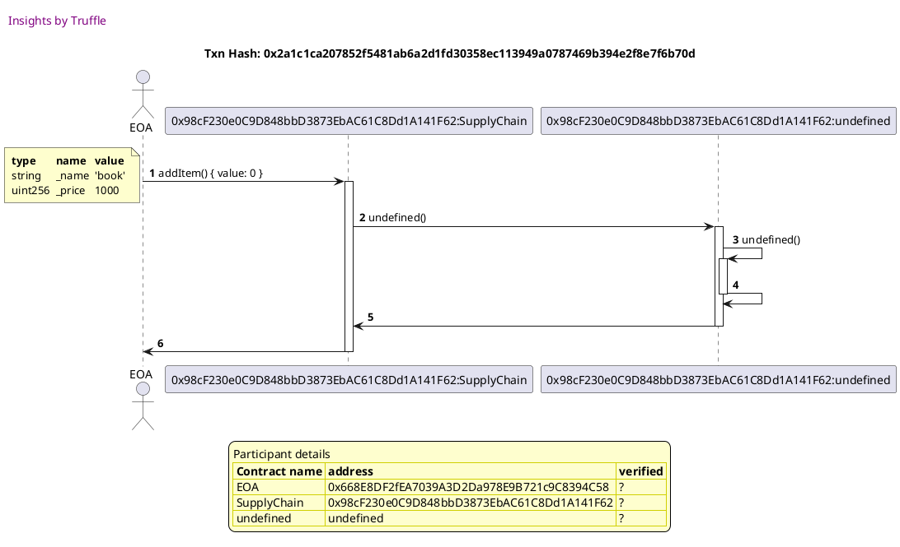
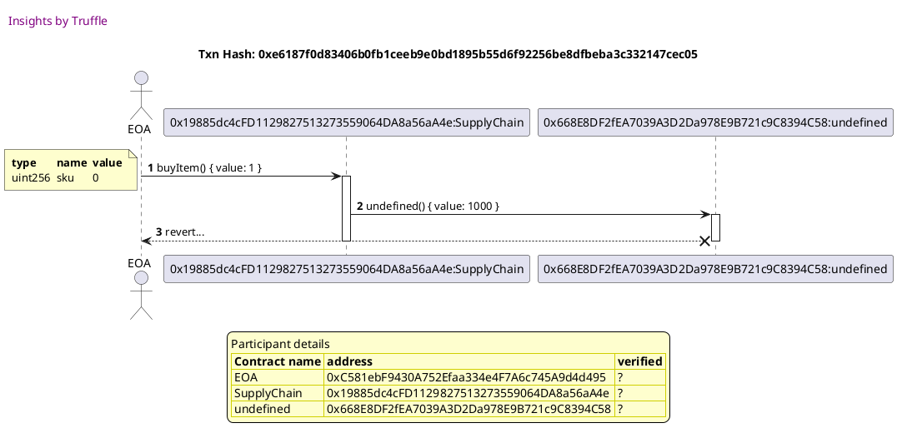
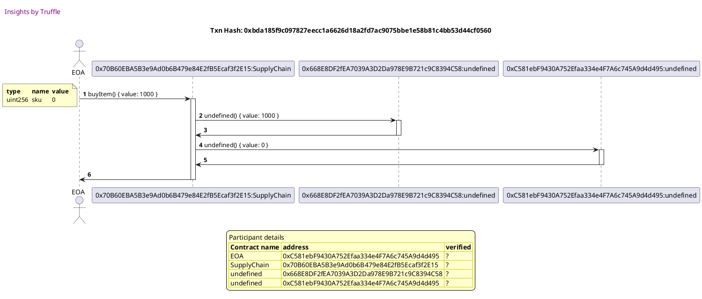
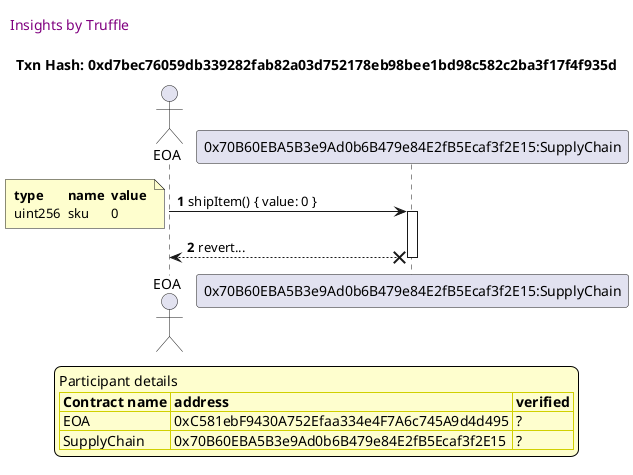
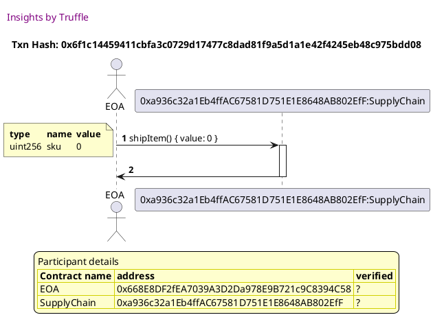
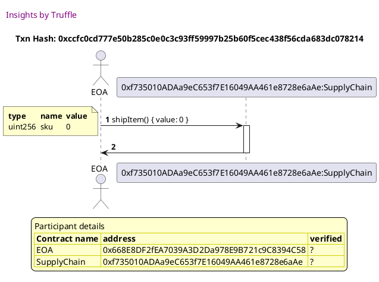
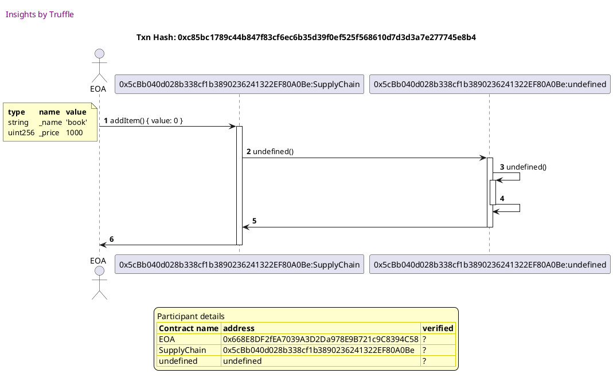
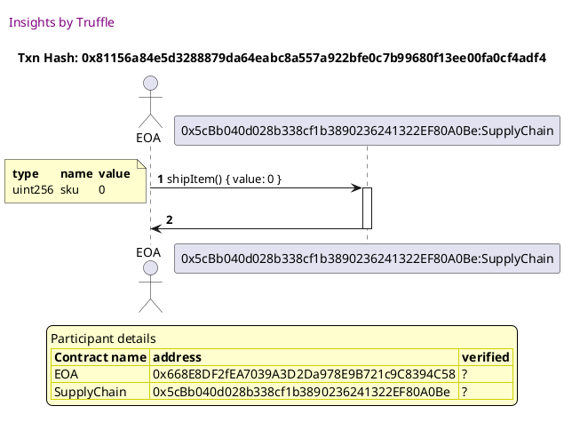

Test date: 2021 Jan 28


## should add an item with the provided name and price
Tx: 0xe2d9a4f1c3697f82170f4885eba09a91d1f747ae7431d7c465341038ac50f811

### diagram 1

[SVG :telescope:](https://www.planttext.com/api/plantuml/svg/fLHDJ-Cm4BtxLupO0xjYqThvj2iMA6aYE2qIt96JEAr5waIEiw9G_ljEqbArvRBQpMMSUUFdvpUJN7TEMjSlQq9axnhJBtDb2UcUjMcbbKkerLoPyaOMptFRzAPCchgny2LBipH92RdetAfMbuGib2oLXJS2SDjO_TeO9-jfhUTcgOn3cieXb65wmz3sjgtLDlMWNnMm0D_kPLbgCmT6oJko__YW_-2_CvsUBrm7-GeURLzLo46SThM2nnS3jx9RJ82-AAyKCgXOuKSYhhZ7Obe5d8SgbrH8mKfMnK4iLHpuh8oB80hzW56VooAa5MSCtIWSgan_JK5sS8BnXA0XJXUwbNYVXxvjwrMoaDeyKJRMq9T0y2JAcMGyYuJ8acd9mY1NOJmjQPW4GIOeJvYNJ_Ps7zAYmQhIHfN_GBhRUqB8eFlyybZbsTa4qDyxfvPVly4R_9Prhz0kU2UcSMfiqgwr5zl5zssyNFy4jseLO3HoESQH0DPa3PspGzlMyBJ1u3HlckVJ4UkrSLuO3M1hTJ6WZ5AA64uM32SJSgGKjHzOCIZV9L0xEK3_h_hyVFAvubZFKFDPusZp016o-Kx8_LupI-Mahhiz9sTqXXSVd4nmwYtEsCvAx8jLNJUwggokj2hHe8kT-UDPQnpjAE8fdsLUbKvZwekfF_DcKiGy5JUnnmgHS5y4ISYn-EgGOK__oFIta_MPQUSM7AwlDZtTUe7FDSRXv_87)


## should emit a LogForSale event when an item is added
Tx: 0xfa960b637f85b598222924084e622cde7535fee8354a3178f6014ed6229f00d4

### diagram 1

[SVG :telescope:](https://www.planttext.com/api/plantuml/svg/fLJ1RgCm4BtxAqRTGtVLhTOOC11rswQ4g3rjfVPUEJ0aLeb1ngoQDltt7KWQ9UbbjSjbpBpny_ERWUlMAUkwPSMOwbnjkkKCBMFjipQDice95SxH53SgVvxRkZD5MbUrXI_JR9gb6MCNhLjLUCdO0bM15juOm6rjzMjjdAh6bPwR9Hf7DAKZQ4hf3KFJsQR2RUf1lo9u0RtTgwBGPWuUP-_4_kE3_eF_phHwld0jp5RmQBko90xcjAiG7byCtAfsCGB-Kgf4yfdqep8EPs4I2o4I4V0uG2b4Nc0K-c696FjXe7mlYal9lG0B0fEIyo8WDt97AhDVOr0jd50yOMI8qxbk5DtdeMkQQfKkb3PFt1jg-8kCfHWh7iiayAJqlTIVt1GoYACWyNaIHButpeNWEDhRVKXB1cEf3HR_GBhRUy9Oh_lyybZbsTa8oDyxXyklt-0DVgkgGx8Btfcf7GvDshNsOhlulesNwv_WLWq2HQEMGnm8OCtMq3hRjsqDJniCJcTr_NmwO9qsJeIo1nkhynxrEEU4qMH1Vp9ZHqf9-u4LlV9TWhIp0_J_gi_FHvyhZlNqDPyr3ZRt46ERxuJTxpMpGATqrUuvEU4JkdZlP4fJRsd6TbPINoosxU0gMbrgBCYWYvtvmrbh6cqfuooUJ4MPZIFk9sD_8YOgYU8ikOc4boTfx2T16iPKV7N8iAT_m_INa_MPQUSM7AwlDZtTUa7FDSN-v_87)


## should allow someone to purchase an item and update state accordingly
Tx: 0x2a1c1ca207852f5481ab6a2d1fd30358ec113949a0787469b394e2f8e7f6b70d

### diagram 1

[SVG :telescope:](https://www.planttext.com/api/plantuml/svg/fLHDRwCm4BtxLuowX-wg6wqD14oKJPi2KNlQIkszCc0IAyGWOrP9c_xt7KWQvUEoskKojj_u-VdDcBl62cFRLKc8Q6sbsrKg3I7DKkbQ6B62Kiwbpkz5jfoRgjLvL9MLWI-pP9P42I7ZncvAEI5a8KKk3RmJW8VAgBTAMr5EIpNNAwajqXGMeHakxnZgrjIbt2yzgpS9pCFPayXpfUV0AFb0zX-Vz9_yZxfHyuLj8Dt0YscB0Zc8LRQKyBBMy22QnGZesX4iOvbmQC27JZ7qE1EfBvoS5RbBtI6N6MDkw8K24mBF3rESIAVWCYZyDA0vkf5PL9dyce9eu0hZ5K53hCfKBV0-psrTbvje8PH-fQpFeUkGPpF7fP96OSmzdgQnomCtIQUHpo8UvspAF3RpdT7HxbDQD5WMIily7qWFUwy8wNGF9kSgRsv6WFu-Mhdw-WtUuRSeMubsmGVHbPLzaGwb7Uy7t_Tnilq9TbDBmAZ5geyz0Mp95Xfhkh9juNM7mNLQLSlh7ckLjixGxy3QgAn36QKKCUmiw4ucv4mfQZ-nebD-M43jv0Jzl-p1O7IPSQwdoxdKsDlSGOJitWbvEYfcBgrGPNFaP4nZl7ZdP8HTRx373bPYNOnicjvLQLIXP8u6ZG_czsTjiRLzdoSydZb5CWse6qxTs8b56F0al0ySbeKHnrwEXXoJRqyPZlJtJ7_RMPTC1xVWT7oxg-dU2_pkC7O_bpy0)




Tx: 0x8287f504721680fbb1acfe9a87396a524ffd8c264808f9f4767575b85d0528cd

### diagram 2

[SVG :telescope:](https://www.planttext.com/api/plantuml/svg/bPJVRvim4CVV_LTOtSkchfen1aoKTQNyKFkqIktxPB2TM246WPcQDltVUw5fbhJQblB0WJb_xkxhEovw9petB6k4nE0QEonBrI7KBunjHIUMk5OpPUMbg1QphXciJ9kwwV2d8Y_oD4TeshjLhSuHcYiXLOSV4SPNJMSU6kj4dTHcPfVAEi1e1vyAM7uXj4FNrcgxT6iU5FOOlDq8AOsTOO-W9w1_UyM_ygzjRsPpr-DoXU-wGMjW86TShV3TlSLNefzFCBddb4Sw82oYNiY9BajFL5h5WaT-78g0CgqbhsZ8EE4wrYmAeo0AIXv84b1UIL2ZSf1b_ZF1eiSdO4yG2E9CPLe1zTmERLklqhamzXVnHXzo7_Ege3vH98qppdXPPZu4pCia3RsKPz9BFEOL8PtixJx4Wi1A6wla7sWOyfnd1TLv4X4_JloCPYAEU1vVGdLLd78_Pcd09xkzVqNIBHAyFLKMCVD94WKqrqBuFbEiY9AmYbYGn9995WVxIBIHukpyRU6dfnDS3gjhfvQVl-17_5lKWvfWIWZ1JyWsJer7lskOwVRXwzQUhxzZjseL1cl5ShGZ0w_H6W_6EXg4U8txnG1t0glGZNZ3HUXDAf3SWNoRr7OB-ybvByaTEB-lxEniWlyTWdua13q-nAZqvXD2BzE7RlREKoedJDtlAPcH3C9jb4nXbZhet9sKC4sTwljHLTKPRPG42QSxySTOeElHBG7EFmu9U_cFf6E7u3rffzR8ERRl_yVvO6KWzrPqk2x0RlwDpm00)


## should error when not enough value is sent when purchasing an item
Tx: 0x170803b701aeee6e07eb0b75126f0216f001a47654e876667d3888142034e598

### diagram 1

[SVG :telescope:](https://www.planttext.com/api/plantuml/svg/fLHDRvj04BtlhnYvXxHAeoxVYvKwSGnMScgav1ujCDYhu0KjInKdpd_lW1tBTYvLou5Pzis-URmPk6wjDBPRLOp9pjQwMsLe66kVbMwaaIkeS86wk97vyyBKdIvcTLKR-39Fv-aiPUoojUiA9umjKHPeu8q1tDP6lTRQocfQgOLUeRP4Krg2vhIzPMWwqrIustfGhmYEJq_tiYYKNe33sJkn__YW_-2_qwrQB6qBsHeUJLUMnC6iiXN2uuk6Mzakny1Vd8WBxcKHToGYXiWZp7WM1OuRbjnrw4Q87uM1Zo8Amp0gF264uxlSyp681RcHMrAP_fg2R654SSJ84AjorKXwduUkQQhrR2cLVkBEa4DLOo628lVpUU8uRYnSAkYvaHS4CG_zP2fa4CgfZ-E3qyUqP32MIcFn3wJxioF6UjqNarELv-TZ87_lBAw-VeCt-2sh3iakU6UwjZWqQT_QoztY-ovEDZ_1hXi4YbgkXZWGm8PjeBMcRzi6dhOOd6Lr_NmsO9tIrWt27coCodlKuPmJHfC5VMN6JfIIzYChUkNx3TBEZj3_oxwu67_EEDNJvtpMEDZSGunjlnDsVz3C0grKLNlWPC8JUl7UoHbDlQ4Psrj9VJ7OjeEhQ5Ifi223BlVc3xKsDDfXA5AHpDqodKRSYwTUuYOoZaGQtqIkaySpuSN-B12KV7NCSA1_OFhRoVhCj7SBZjTNsvxklA3hccB_S_a3)


Tx: 0xe6187f0d83406b0fb1ceeb9e0bd1895b55d6f92256be8dfbeba3c332147cec05

### diagram 2

[SVG :telescope:](https://www.planttext.com/api/plantuml/svg/ZLJ1Sfim4BthApJffPqqgGG8a2TDGsoOvDJC9FUEG8kj2HQC41axSVwzQ-AuTde91nQMrPltthxXglVA-M7P4A86tzfXMO8Zf7yqjbDEBMa3Sx3wMbMFSzSELa_RfdNqIv4N-JGdvABtwmOk2Lc0qk3e2w7qfdNckRLUDLbZvdO9rYDCxV5JWUqtX6vmNGExrhrv1ieZVBjJMXixfvoHLqJ_yGx_ZdzhUpDV-9wMQ_hWXhf63EADRu0-h2ozKVrYGjaAOfucDTDf6B6uP7N9Au1I0YirJwKeXT1nBOD0n2MakYwXL64LXW6FaWeg9j2DoYFB_7T6LKzFi9uGDCIRodGAzTmFNTUifmjbx1_6nncsuZ9DXQwYgfXn7iWqI0GFWoGKGh8uccMf4h7A8fWSd3w6HOEXDXRqFz0uJlDqLWHrdYKib5au2sPA9cakhvE0LtAQXZAQYdIoFtj2o9RtsUL7bgUd4reEwriFow_Vw0jzKiq04yhfAx6jXt59-zLUx1w-x-hbvYVrwmueLgkMOnq1w8Piw62iHpVfXlQF0zuPTZ4tT8jBo0SUoEn8w9RNld74Z366v8w6LsTu7FLDg8CdSFxy_9nem7MP9uKQ3cSF-ySKC51lmIPt1-vhyCeq_O7q6PiXXQtqASRK8TfUEmRLGT-FDe0pjG6DcY_sRetPGIDMk1iEPI6Za6M92F9QgJ2C82gIBAwII6HIHpgI0eT_7ICSS1wHFfkl_v7shemudutK3WTjsfc5rnNMxU_YBm00)





## should emit LogSold event when and item is purchased
Tx: 0x1b681bc7ed6f25aa21f147cfeab1d628fcb3be40af8d27b9fea23408db3572df

### diagram 1

[SVG :telescope:](https://www.planttext.com/api/plantuml/svg/fLJBRjim4BppAnRf8IrIenBrDjmaZYGZEJL0SWyeaRG9ovH0KKMSEF_UbUmOVboALfUbTfR3uUnAjwrbndQhYX3MsLftgq8OGjgbqWqpR0MLc0lDxrYvd9kwqpojgzh0bra-ozESa4bhrvMu9cGX61S6tWd0VMtKMwqjgwQLckkLq1Pff4LeXkajGzEPfXAxr9Dw4-3w-FR8E5Tw3gv3Ff3znoVz9_-3RjLyOLierl1iEYcHWrXbAm7FhnhkMRiOW_Fg5c7i5cKaU2Xfm1XrfUj7fHIiS7b8OraMNY5yXycOqwX84A2UxyIyy8A8Sebkb1PLvh-cm5gum7X1q12hIjKmlCzJrpJLEbqmfLySTwXnNeCWJJsH-Pdd1yYLOgHHJfCezwFO2toQXTGh8Za-s7rCYmOBgRJW_q2wttj1IAzxT7sgykfg3EZlWnMhhz_W7NwpgXDe5tmGNLinD6dVsibkyNqNhpS_mQuR0HWrMmrn880DsK1hJT-s3RniCRWiwdfvEM2TqfO6OGysHfKzwZgEWnXE5lGd4tAY5BKVMT4htoTGEpb2_wzwD1gVLvpgwMlEDGuszn0Xs--4F1uqamlBLDKUE9av6LwyTpB5gJSuOtihiIz6jEtWgZ1AAi7HeCdU_E6i3Ovs6CPvdCsepAUHuoLJBwCPIw8uJ-uYwfP96dk9dmOn5jySCnpe7vZ-ThBEcVPkmV7wPjlJdHVut6BiVov_0000)


Tx: 0xb2b63b2ae3d6dd11ef1a30388b2a51dc9d127b77d087b70e3e1c27459b5203a1

### diagram 2

[SVG :telescope:](https://www.planttext.com/api/plantuml/svg/bPHHRvim483V_IkixcLJLytOW27gkb8WQfzMgNsV33uIgyGWC5FJfl-z5vfcIQjjQHvooM6-Et-SEU-Twjomg0bHWslii2YW8wI_CxPLdLhG6cPWzOKgxsPTCrYTDdNJqK_JV9gdEI6dlLlMS4R879I6ZZuIIY-RpZmqrgawgStCBi0wn5GEBqqn_K9eXwwjOPEwCGz0FH__NIkjZPrHZv4df7zxnR_ohsnlPdFNqs99RxkXgf11d74rqDjxIozLFvzGTb_m8XG5Lo1qgBNdGUKfmKGKOIxmT1bhZyj2IiqY30m4U2MNVX0N0MT2UMYZTDXb_ZEXggT768y82d6cDAt2_TmCRLilqxaozXVpnZNiFWZIL43cPy8FMAHJZ5pcF9QvBoCH-3mBkIXaDTcvUn-BWg4o5lGVQ1X6UPHDUPKdaeau4HdFL2oZFBwGt2lZD1AndmRHP7llNv5yWyJL7XJJs1SiaG7FAwM4yC6VoYGiqK8IQr_xSR2B96iL9sTlDtvyFA75iBnoiFZyXJxItweUO48vOum-4Tiu61_zTc1EDp--RkBPwZjronOeHgiMOnmPT4LMT33MyI2aAzhV3VZDC8lJIDTSGjwqWitjwLktjatiDkUzDBUt-FtEJauczDyb-4TAyCDBZARNbmXvENtaUkTvQd3ArFsEoOnbM6vjCiMprE7aRbNYQUgWxqUhq9dAW4Q5frlvOotqUl18uE8V-uIT_aVIeOVWFMbhQ-GSElV_utnmPwXx8nq_vnZNxyPd)


## should revert when someone that is not the seller tries to call shipItem()
Tx: 0x1360055ef3a7c2c952f75a43918c1839f3d3ff1910eeb94956c9599714499aee

### diagram 1

[SVG :telescope:](https://www.planttext.com/api/plantuml/svg/fLHDJ-Cm4BtxLupO0xjYqJhVSSK2JPiAJei4T-GcuzOYTIB7ML4e_tqdQQbQkAnsSnbdtlZv-SqarwsJrdMhYZ7PkTfqgpbQnjedRHffvGegNA0fCrayBMpTcN9ILxM5BxDybazonYvQjwxmah4boX8jl3A0czhgbzeuMOqhlJ0hD8veb2DeHkajGzFPfi9Twbw_87WXlTt9ijHc0HvdRyJ-uvt-dV_Mj7gnT2tCr_1WEwM8WpdjAeI7PmCtibsEW3zxGSnv5A4AP5BuXOXybKGo38IN5buQ21MKWLAUy3ZYN8GYYgb6YCGBGo4a4gSi7AdCVur1jd12yOIH8KuNkf5qd_kkQQhrP2crUUJUKCEV4vx5FC_6KHQW69Ty7cTX8Z0DSrzbKLv85IW_zwBHmUvZMZ8ObJPO_WFfVky9OxtkyykFAi_EHa3-tZfSVVq6h_1RLXsINV36JErmQDA-jHUxnVTTlDpy1BTk42WQkHhYG00Rje7MsRvj6tZSOd0wh-kdqm7hj75-5FTWOtNHenxdd32QBEXFPko3Kj9-P4MlV9yWxUm8_R_gy_FHvugFUlgQpne7ctk8iUrtmkuEcbcYaxfg3voSyYbTl7ToGbDlQSRsLb9VBBRju2fQhJIMPD35tlpXh0sDTXodUJgT-IeV9pmGus3gJwL8qbnaYUyLOaBZ7KwYb8glZXaEz0zCVpjPdvdsRi7n-chRqvqNz5nJx7ykVm00)


Tx: 0xbda185f9c097827eecc1a6626d18a2fd7ac9075bbe1e58b81c4bb53d44cf0560

### diagram 2

[SVG :telescope:](https://www.planttext.com/api/plantuml/svg/bPJVRvim4CVV_LTOtSkcBfenDZ-YhYiaHEtJAhNlay57OfKO16PgslH_tuMcMTAkMyO31yVvuxklxxZed6fTlwm8KRshRR_CeIMakpEsKQrQqWhcO7MgYhjvM_TMJ-ggRkc7MJRB9XaXPvrRLN1Eo0AKXfO-4aelwzOyrDQfAgdCt2x1EiIK3Z_DqFrCQFgsgM3hkZ4FG3s1RzTAQsFdr6Fa2UbVNl0l_2lRcVd2TJHVqTksBqja46TS1VJstj9BrIt6bDtdMdcHBEE2nM74Gu2Yy5GGy41xaUAb3bKHir3cENWWeppo2f7dqjT252MJ0KCr2eTPPjyJgZfwWlQ4e23E5APHMCzDtpJLQh9GnlvWtX33xaEM1YnB4vdw42UQvK4gmXWYaV4obLcXIh_acIV7UwiFiIWmbCQ2_WqDWYYBfZDUPad8_3ZnftogiAeiJaFk5V4aycCnaT5uj_PT9DyYCTg3V1OBdoMXv5cfbEyB4BCm2OfGo2JMGejOxYF9HehH-Ul2Jq_7DEzNLmwM7p_HH_fJLJsCyVWOeq_4rWw6ezyrpDdsuVFMdg-_KhTgWAArQZdOWK7NP4rxOnsN0LtJxgx7EqClTYFTS0bvbGecTo3V9hMTum_97GI_hMmq6jE_Ry7Vt-8Ldn_F7sJUV2BaUVJ8zTvXQd3ALDsUZ5CsnN8sCavma5fisvsEE4ejTDqWARIcDA1HlxETyiDUAEhH_O31tmu9U_aFf6Cdu2rffzR0ERRf_yNvpyfGxgteU5sWtVmOVm40)




Tx: 0xd7bec76059db339282fab82a03d752178eb98bee1bd98c582c2ba3f17f4f935d

### diagram 3

[SVG :telescope:](https://www.planttext.com/api/plantuml/svg/ZPDDRwCm48Rl_XMZx6LNtMRDLu0ecosaHErfAxNtbS53OWKCCYPAslI_TqBJAErfENZmC3oyCw-vwQmmjgyhnaHl6ztNEHh6ketIhJ2YXWfNg6KgYitADBsMYwPg37nRPijiaJ4sw-o-mZbZQnGI3RmmWBl6gET6Mr4bbLhf6hKbJ6dfqPBIxuIsDss5fzIZUaPmVDez22cLNe73sIlHVttWF_ZtkbEhjUqWtyEJwSkI6CmgMo4yxJJSYMuz1RwJOOv5EE51B7FFYzt8BKKUkO9xCWnS9ummZwCSqSbb71L1v1PkBhpI2Kk_ZBr0qZGAIogplmc83aOKHum6ObMXMa7zFFPjM-qNQw7qF-uCDNmNydJ2ipG9KW_ZHF9yalfXZ96VkMKQP8KelTBDd61wyVQ8iUD7hkTVaLTNK-ZMghstM7__0I-m5LMFr1oyCjrO74PwDc9sklbvYlF3Rx3x5e6Y5lKG1m0Ss05wfQqRJE00tQQdbLEMN8OZbx4lGdRN98uqJi7W5eqTZyTC8ir7RGN9-5nDJhsV6FPmCIs9LgYgkr1vosyvvqUL2_BV4Eqiaqw0mQuR5ADHfK99ycRdnWPJIFDk4KGEvilOztX2hcQb49xdexyCaqaH-a4IIr_wSK35VpuJBZGFfFyrxaIYzavDqdL3yVZ_l040)





## should allow the seller to mark the item as shipped
Tx: 0xee9406e4d4891f28c84ba18752a37f30d72f00403ce36651a26fe78fc94fedc8

### diagram 1

[SVG :telescope:](https://www.planttext.com/api/plantuml/svg/fLHDRzim3BthLn3TeHkwOl97R3d8sgQEW_Qq0kszK6mg4UB8XYmFJPl-zz5E6YJfPTXyeSn7FJqzqhvfdBIkNPMCoTPLfbtDq3BMBBMffPKhA76EfhYL-N9kgzOKQLLM5hvCiscMPeoD6hSkyOgn1Se2BRmnWBlAwjVAE5cEIpqtApIEQ9GZQ4hfBKFTshh4NUfHlo9u8RqzoABGPWuUP-_4_kE3_eF_tZHwld0DpDRmP5kbY8CvxKg4fnS3Tx9P386_82OXZp0iGf5uoXUv26VI4_70bq6i0bx4lk8yv46EGHGDFEb72cEXyYHKMEI2tCWTgSn-ZK4sS4RnZ94XJkUwbdIVnxQkotMwaDeySw-luIyo2Q8yyAMNpKAbncaK3uGtYGTUvcKY2iNuLd0_KzFXmUvZMZ8ObJPO_0FfVkyPOvtkowjJbHSNGo1_xnskldw3D_WjonR9BdXdfdBODsdVsj5kyNqNhpO_mQrh18f6hlhO4y26RQ1njclR1fwt69pFgcfvtcEjDiuVH1rOMvrtgCSv9umc2xgJ6JjHIjgFhEYKxnEadHsX_rTzUJdyN76gfwlvhB6tkOCOstudxE6WcGKwgSlcmCa9dz35EoTJcdfBCxQtalfYiMbwLz5gfR4WWqPxy_kpDZJQKIGoCPdwAXl7F4Z6mSIVo2GMMN8R-rwUf298mdGWgFZwcE50Vy_qjvFrcMdl5XolhxSztNb1pmt5xkVo1m00)


Tx: 0xf8be90c42bc0dc9984b6fadfa85aaad09168f8a9195925286a2c2dc7fe5a0d3a

### diagram 2

[SVG :telescope:](https://www.planttext.com/api/plantuml/svg/bPJVJzim4CVV_LTOx6KJGtESNtR5625D14z3WlVf4ZkjHUf4YJDHAFyxrr2w5hIjv26NEEVFtNrzb_FUGUU6HKq83AwnmwBG7I7zdR4jTB2WjPvfgowWl9jrpM1LsjHDHp_bMPwb6I6dlLlM-eoGkGQbE_f8ABriElFGM0TrKfkPNMZh45Cv_9JZyWkX7Rgsrfkb6_EWgHVWspKePUoCUemy8VtRA_wLVsLxCvkxdXPBUjiDLOKCueohDRszj_GI-lc4iljA55goCk15oLGffGYAg09LWGW1G37fHQ8I83qPIXvo4G4lkIhZIeV0b0-eHkamo-ndGg6dHsYF20hYJ6bQm7fkXhQjb-aSZFt5lD67tOFqezBdu6L5K5L96iMXyAPnw6LU9g9091U2yQpA9pkxzx4eiAwCrUeFD8f49gOvhx8aPhvC_2cVWen59YzYxfKo5RuCqb1Cjdl_YkGR97fxkiXbuBCa3Z4Z0DyFT937ILJ6GPX85QX0Xhj8ifRYvEnjuSV74reCookd5v-_q4Vw6-f1JoXdZD4dOXkdnwFVDipfvk7hnfwjlbEtR3L5Qs4nsf51LsH51sCT3oEweltTW7U6gzYDTCqbv4qgcDoUVElKjWkxoNaloUqvlw_iv6H2_ns2VoG4Fpp4gFJw4o4lqqUkTyvJQGUcxdUKdB8fXbihcU8iTTYvMobncZhTzwEgkZELqGebFDsAFyP2NGzk2NJ-iK_OoNya7Je4xqbRjKREeNt_Fyu7AqEvDwBZTOvs_Mzy1W00)


Tx: 0x6f1c14459411cbfa3c0729d17477c8dad81f9a5d1a1e42f4245eb48c975bdd08

### diagram 3

[SVG :telescope:](https://www.planttext.com/api/plantuml/svg/ZPDHRvim4CVV_IbEtSkchfeD1aoKPIL0r3wjKli-6MmIAs0Gc2bfq-_U2qsZh4_ZmGU7-Tt_xczk1oTxDpOr8N9qhHsRGlU435jZEzdB1cgzrbOjPRbTz-reLThMRGzVLlagJtD2veFRrtf1o4PBfNju8G1tRM-UM-jadTHcRHjj7M8gXwzMc7udT6FVrVgKUZJF6XZ7fmUfbB5hO9Iy8lt71_w3Vsy7izwu0OezFFLZLI63EEDg3Kyx2tTosCo0xiAAbOpp8EQCbKKb_P96NgnOnAEe54egmQfO1ef9fhbNSOy7kk2YZAEWK8eAd4RfK6N-Em4vm1N6Au83SQOqdSH-7iUkg_VfHXhxXx9f3zt9s0zBtvCiBtXL9MaO1O9bKS1obekGYsGfg9TNgzd5rrU478lSB3uZhwzdC6nCT-zqy_KRlC1VMOyQcuDNObkdfv6UZPYVRhwVukBm4zo-qu3HocQA4m0Ev02ZiSuBGZZ0i1rnfPX5b-789UIJ49GsARoP0VhmVXx8myKib7RIrCE5XencbDAZXXJTxN6MPn7eRw-7OTAZUrCPhR3u_2nxgdKuMXYAN6GhhygJYFfnucTU9kD8vF4oybWPfyAFUHe8tFphNyA5_edqlxQSIDZUgKcyRZ4U_uut)





## should emit a LogShipped event when an item is shipped
Tx: 0x2626f2c4f33e5f1abfe2831af944d60bc10717d11089554b11c525b3c8a232a9

### diagram 1

[SVG :telescope:](https://www.planttext.com/api/plantuml/svg/fLHDJzj04BtlhnZH0wqewgw_7L70E8xWL2IuexKzJbOuQskzhWY4_zwn4w8aNAhMbrdFcttxzitOrvsLnlRBcZ7PsqRtonmDOzspqgqqSWarpb6NDx9udfkcrsNQr8s1BxDibgKPOnUTNTLuoTW2POa6tXZ0RMFKQwEjh9DQpVKIjIMQoX8qe_I6eUrDM-CszQ1U4OH7R_UoB9MUW-3idTX_VD1_yD_fJiqNjeDy1O-chohYO5RP6k7nHSEjx1OJu2zEu0ILKtYLww9V2PbNw4Ika5NiUMN0yqBmK8Ib43oAVT_BXIXyny_T8fAEwyYOt2WigSn-9I0xEA5umiWGgmhLIhhFGz-szIfTIAMVk1Xh-4iLkZuNF9acCiOqyDqgp4J0lJX9l41W53eH1ZB1oTxkGreo62kbiVm7qjtU4yO6tUUNnohFpYP0_jvPN7xz1c_mMzOzabtmpdHZSMpIhhKNsyNtRRnS_mIxQX4eQhaSuqW0QxQ6pfgXRMjusc1mcZVDy-c8zKfRnmy6i3Mg6531EIUC9Wk6anaxKahQ3wmObEyIf9qTeFzNVNu--Lnnh6Ue-Qnnj7c06Djy9-n-hvabMgdgRi_9AP_InGSdKvfwGpEsivBwOh3hHbVHg4fXIGPTxCmVprhJQ0T1b4NJcLDbISZTE76dpbJ6OPJ5Dw4ZYZYDtDXB_OYAhmuPzlIFJ7yxMP-PTcx1uVfgqzEj5_HSKnn-Bdy0)


Tx: 0x7831213a29f5270453e6c4ed2b5ff2550a9e0d46e3d50314658c40c08c45c35f

### diagram 2

[SVG :telescope:](https://www.planttext.com/api/plantuml/svg/bPJVJzim4CVV_LTOx6KJGtFy8pygnWXfAdWQ4hnFRdnfBL8dIfo9GldVkORIjQ1j9G--v6n_xkxhSyuxhrlVBof2TEzhro-cq1BItLdNw5OlQ0KpSEP25tUpjkwToUggRkcdIJx9ivoGqyulApWZP0xQG4iV2QMNTMiVQkTrbLPsvXRWF69AZrCJTByGchvjAjYuRkm3q43YrxKsnheP3HXvGlgtL_mh_yfrTZRt7PqkwMtRboKoYBU-0dfxx-YbxkOZokwZM0Gy49edfU8Haqf0M4WmVAhAaYl5T0BCo124KKm4CbHn8Ld1S5I5K2MgKNZCCl-PKjtH8xH710Nnjh2Dndfk-gQfbjbSM_UB1SCQTbz6Gh60fUCKyLceH1dbGSXaagOo322EU0oXJc6qitiVYm93QHsOFz0mZFDuFE5bdaPC9AaOyx5EeZXFBY8U54aMYqHcAXvjz_uLoJT8N1t0T998mT98yRpKMWW9SXAbOH59bIP66fceNIHPIt5ozhRmu-CHdVRBAm-Bpr_e8_sjgnv6b3F6w1DnjOVXwBSDSxfv-RgnPwllr2yRe6YTNWnsOD0LMT7UEizLI5Uqk-jnPEZ5RgHhBY5lKi7azkHRfxPrx2ONl2Itj_XzPISd8_hl4FmZ8VZX8GQbrrE4lDm-ShrpdWQyjbMte-IOZJ7SMiaCxrABdRkL4czJ2rqtg0gjBIqObF1qA_uG2tKzk2LmyOzzmax-0-dGI_2Uj5Lhu1pQz__ZVB0ob7iZEZxdQDV_ncS0)


Tx: 0xccfc0cd777e50b285c0e0c3c93ff59997b25b60f5cec438f56cda683dc078214

### diagram 3

[SVG :telescope:](https://www.planttext.com/api/plantuml/svg/ZPDDRvj0443l-oj6xgLL6dK1ysMvRWXW9QT6IkxLUfcrLuO5BKjb9yv_pvWubfjJEJ2mB6_UpC1DxuHrGrCp9WRNcg5PeMMitshJ2IiQg76DfheLShksxM2glArR2r-MvRBCIyRclTlNk61iWw922oyCuAwr-harJjHPhTUcGUC8enmzMjBoEw4RR5VZQUbHFoDuKxfx45MbpHeypbw9_kC3_y6_DxrURrmFgpqysK4fOZ2dNOtmj3Dm9_hD3FXEIYMvhE8unf2l_2IK7BaCP1ee5QPf6g_yS1Ln5KgKqo1HOIGh4IL19NcS-6J2X7HaMVxEGFGmeJXXr12dfUu4rVCuT5szppT2cp_S6_VmdOg3a7iyApAHOXw5WOfBB-BJDCkcaOT9x2SOYGnd5szF63ickLvyHbvTpQ3VwExUOVFr6xp0Nr4FICN1ApEjmx6bvq7CJnVVJt5n-0bkto5GDA8PumY00pl0e8tpmmWEq6y7EdDQfId3aSlO9n5I6mslPq1pUFyUsCD5BofqGjVzXKF12yxvqI6dwLhgvLc2vcknxqSVj5ffh2Zv_AmzvYAZNHGbPL8iVLLcCG_IB2ZyGgHnKgQtiU_9D4-2T9g72Mt-zI_Xmdya_UzOJYGgxrGa7JSKZt_76m00)





## should allow the buyer to mark the item as received
Tx: 0xc85bc1789c44b847f83cf6ec6b35d39f0ef525f568610d7d3d3a7e277745e8b4

### diagram 1

[SVG :telescope:](https://www.planttext.com/api/plantuml/svg/fLJBRjim4BppAnRk8ItIe9Ie1sMaIVoGaPmQ8Ba7b4ZPH6HAeAZ2Jfn_xqfs33ykHQlBKZlBuN1sfRl62UlQPKc8Q5rbscMcB27DgpQri689fPeh8ySYVvtRgZLoKfMLXI-pT9PEKaAk6xSkrGqX2oMail1E0EuhgzyguqGvAlNSB9LnI5CuX6QOtZBKhQrBjKizwJS5Ne1lZq9ARURWKVA1x3y-wJ_v7qoZvmlNGBQ6PziM1N8Gfrsfu7bbu5uqYo7GLSx3BFTYdkH1aF4WBZZBYqZbKSP2oPA2gYBqmoACUEHH6KiccOYL7yTn42gU1UX6xb1b-ci4ee41nW51GvpETItmFazjNPVhoK9eyqAzleQkmdoSqO1AwlECCPuNNiPuGdqM-O77V3-TSJgYOpKys7rCYmQhGXib_u5qltT0IAVxwkPKvUNb4D3V1wUMNx_1E_mMPQlGBlWWfdAgRzA-jTUxnVTTlDdy1BUk5M0qOjd7dW0sP0EDirtRDl2onU0YgwhNYnvhjN5-67LWRNNUeHwb536SBEXE9kH4AMe_ig9Jla-WTdA4_b_rrTNmlE9KJrTphh6tkOC8sNudvF6WcL8veSlcmCafdUB5EoSdEFKMPsnl9VR5ggRfNLLM5rf9DEXwRtv_rWP7EufuogSplqX7CMN9Y4tzgKXYdYRZsFVoPC9P4an2ZiMtnmm7-dkclvsiSwQzMt2yljtsTES5FdSOkv_B7m00)




Tx: 0xb93dcd3735c0c450ffa624807ea58ab038d9b4fb0fa1c2306f372d5137f4d406

### diagram 2

[SVG :telescope:](https://www.planttext.com/api/plantuml/svg/bPJVRvim483V_LUSkfTDNJLZypFgkf84r3wjKli-6MmdLeb1OAQcJV_tNaYQ9QssfJnmOCntvuypbvqJhUiN5I6YTxNj5uLg2UdkZMr4AnPGgPcoSYpA-rbRzrPEwgfkuLEUvTaa8-IySyjANH0oLqAg5fu8m5NTciVQEb6bbPdPXR8ECThXeno7DuIcRvjAROTkpQC2pyUx6o6biJFmA7b6-hTN_2l_sdPcDdST54kuQtkjaK6SSPM2kmSBLwARZu0-50cNfUGH3qfQ-W7LMeJCZscaH12BWl9O9eMl2wg5Lp9EGyqZ9WEFHzgNFWtHHkcmoknd2gA34umd18KuKvf6u7fk-wQfbfEvCFONzOOvz24enmNrgQGiBZYFI-qLF4ueuvZRuunbUKnJEbQZlRSFiIXOQMEL_0CDmpYBfpdJMHfHdgHyogOYYU8i6KVCAvD9p1D_4iIZtRj_HR8j4cTxgiWJdzCq2bYcXU3SLtuUfM4P-K6QIBIG1Fj8ibPnTl5suQUd8oZwvRLJYyzVu0b-YwfN8s2KKdWcjdPg-FIxXZdVNdpTnelLTt3BHW56AnP371Ym8YleZNKi2645tNsFPugZs8smvXBofXGixa3VkhJTm7vntgQuWydlLtPsDe9_fs0VIS6EJp6ONZyYPBFxoCtUzvJA2LDrUoQdT8hfrYOdk9TQxDoTIjnDhUgwmQfgZJPAeiBpdVmX5tezkYLmyez3mbxz0-dOJV2UjBCrS8xj-_znFhWorBsLZiSbnlM_yGK0)


Tx: 0x81156a84e5d3288879da64eabc8a557a922bfe0c7b99680f13ee00fa0cf4adf4

### diagram 3

[SVG :telescope:](https://www.planttext.com/api/plantuml/svg/ZPDDRvj048Rl-oj6wQLL6dLPlXRBTMDZhEJKICczMc2mLuO5iKjb9yv_pvWubfjJEUp0i3ppphpBhNMgTqDJCwO6rvgXoR5dp6wrwLIl6gXnZQPSg6Axxjl1b6bRjpryMMMhBCqOcrgtht76s0PLYJsyC82xjjVFhN6gdjTwRHeqZZ2LerShIhyJkg7lQZob7lKpWXVGquCgIstMu77sIlGV7_WF_hsnUhrn5l8zFFL3LH63EUrgXAUTWJjbDnFWE-bvOQHaW67f2obbd9Gg2b3bXLHX6Aj4YBn2NiHvaaIILvwFo7cbU545ggm2caRXI6NsUmxAmXN5AqO3SRhGdQ9-7eUkg_VfHcdpXtlZ7huBYqNE0rvo8NFVbqNbvRvCkF0Z4NY-4DbAyZbVuEJYwol6ZaLkPf-HrzSJi1lTtJjildw35_YhwW6fENXbfdKuZlHinFHqy_qKPuUVuFOT0aMZcZ6E03Ym0mpQE156S02x7MZbb2MNuSXbx9CGaZOgl9a0-V1-7jZ3nInAT4hNzaB3aYyvvqSDARdRqopF8iZV7gqTzM2lAuqb5P-UPO-rID4kYcGcbojHPVEO-ydSNugbIcAP9OjOU4MIIZy9qb3Ivb__4YxqZwJ_jUL4elPEJT9rI_7uTxm1)




Tx: 0xde1f2202f536e9e482a688522c9400e8c03b2b912ca5037477f80993ca7a3fd4

### diagram 4

[SVG :telescope:](https://www.planttext.com/api/plantuml/svg/ZPDHRvim4CVV_IbEsSkchfgnJO0eoqhIHEtJAhNlau4ZiG866LCbRVhTTw5fbFLfFFZWCB_xt_tDJUUrytrTCQPxtzY-pj0nrcsDRRNJDLIuHblCTRvTkwQtnQAf6WTVLilLSh5aRDhvVOKpnZQe2tJmoW3k6cTU6kjrbLPcRMkqdZ2bfrShIhyJsjwr5PvIZ-O58L3qzA2BmjWr19oz4Vt71_w3Vsyxizxu3h8zFBc-B8d1lF4LmjFEmftkDXFWkmA3KWWkob2ECK4L2psEur28F56SOvnpcOai2KIkGouZ5KLbp9D4vZhIiYmKJIFtf7BvEmNTmOZYYD50lCbDgwcVnxvjg_rYeutzmuDX3z-5-JpZYXTSn9cKSLu6cOmJBkHOg40AiLp5FELpd5nyFMBiMEHwzXbvTJK1XpcQPxptM7_z1g_mhAiUgJzuOxRnE4prxCNqTFFz56U7d-3tBG95g-iX3W0ui0FqndeHZk40tRQdbLEMZ8OZbx5FMaZT8F9w0cJ5-v5W3nVZAD1hKtKN6cxvBUVyg6511ZiQvra4MUomwmOzw4nfiA3YqxFieHOfsYt2EC1ibIZ9qoWKor9hAHMgLPIEyqY5QLAeGYKXRVxrB-52_q3wNsTE96hlr2HTDnIFFyXV)


```plantuml
@startuml

autonumber

skinparam legendBackgroundColor #FEFECE

<style>

header {
  HorizontalAlignment left
  FontColor purple
  FontSize 14
  Padding 10
}

</style>


header Insights by Truffle

title Txn Hash: 0xde1f2202f536e9e482a688522c9400e8c03b2b912ca5037477f80993ca7a3fd4

actor EOA as "EOA"
participant SupplyChain_01 as "0x5cBb040d028b338cf1b3890236241322EF80A0Be:SupplyChain"

EOA -> SupplyChain_01 ++: receiveItem() { value: 0 }
note left #FEFECE
<#FEFECE,#FEFECE>|= type |= name |= value |
| uint256 | sku | 0 |
end note

SupplyChain_01 -> EOA --: 


legend
Participant details
<#FEFECE,#D0D000>|= Contract name |= address |= verified |
<#FEFECE>| EOA | 0xC581ebF9430A752Efaa334e4F7A6c745A9d4d495 | ? |
<#FEFECE>| SupplyChain | 0x5cBb040d028b338cf1b3890236241322EF80A0Be | ? |
endlegend


@enduml
```


## should revert if an address other than the buyer calls receiveItem()
Tx: 0x45ea42b1c3367f8dd5c60017ae3e43ad6203f181fe56a3a7c8d49c83275807cc

### diagram 1

[SVG :telescope:](https://www.planttext.com/api/plantuml/svg/fLJBRjim4BppAnRf8IrIenJrDbmdZYGZEJL0SWzeaR89ovH0KOMTEF_UbUmOVboALfUbTfR3uUnATutbnhQhaX3UsagtgvaqX3HBfMjk-0fAEPTQtFDyEJTLgqLIbPM1BzDicYKP8QF6Raev9cGXkP06tWd0GsNKMwKjBoUbckkLr1Pf2elG5DCxXherTIdtgMVr9i7nyEs92w7q71nAFf3znoVz9_-ZRjHyOHkORU35j4M17CGgMqfuMMjuuCrY27Jj-P9xRERahXk4HII4dmUKEY6NhlHSBW96tSA9d4Bw0NTvc4V2Y_F8PQ4VqJ3FqOtSeihirmHu0rSOhmWQObMkQextUMxhkjma2wxqAtNw6hfsCX6A88qP4pClP48ub37AfhuRv2bB6FKu3zF07nxjFgL5WsMXj1J_G7hOUqL8ftimFbTvSpC4zFVHojNNR_0EltdPIhGBFeYkhEoRT6ZjQB_ule_ZxK-mcre2HirNVUm9O4ksq5ZJjMqBhpiChcTLjRpkiLPfo_oW0skZyWvrAAM8uMH1Tp8XPqfH-uaLdV930hMJ4_J_gWU3uMN5kPwkvb9ZRtC74RBxJiZJKJE5j5oLpP6JAKtnufsJ2KwzmHaxM8bzCR9fUbUbKOMI0WqQ7SplpzhYQ0T1b4Nfb1NP9AHkF75Jbl8uZBBuFcHE7YUH6tk97s7nxId3aVwUwMydwvBfu1QShcztFTrxWSyTnkxdyWS0)


```plantuml
@startuml

autonumber

skinparam legendBackgroundColor #FEFECE

<style>

header {
  HorizontalAlignment left
  FontColor purple
  FontSize 14
  Padding 10
}

</style>


header Insights by Truffle

title Txn Hash: 0x45ea42b1c3367f8dd5c60017ae3e43ad6203f181fe56a3a7c8d49c83275807cc

actor EOA as "EOA"
participant SupplyChain_01 as "0x1Ed7d6D922db472dd102202F536cD2C204aa7D65:SupplyChain"
participant undefined_01 as "0x1Ed7d6D922db472dd102202F536cD2C204aa7D65:undefined"

EOA -> SupplyChain_01 ++: addItem() { value: 0 }
note left #FEFECE
<#FEFECE,#FEFECE>|= type |= name |= value |
| string | _name | 'book' |
| uint256 | _price | 1000 |
end note

SupplyChain_01 -> undefined_01 ++: undefined() 
undefined_01 -> undefined_01 ++: undefined() 
undefined_01 -> undefined_01 --: 
undefined_01 -> SupplyChain_01 --: 
SupplyChain_01 -> EOA --: 


legend
Participant details
<#FEFECE,#D0D000>|= Contract name |= address |= verified |
<#FEFECE>| EOA | 0x668E8DF2fEA7039A3D2Da978E9B721c9C8394C58 | ? |
<#FEFECE>| SupplyChain | 0x1Ed7d6D922db472dd102202F536cD2C204aa7D65 | ? |
<#FEFECE>| undefined | undefined | ? |
endlegend


@enduml
```

Tx: 0x9cbdf317b178619f0fd928e313d48d20984bac4ea989d8cec563faccdd8b34a3

### diagram 2

[SVG :telescope:](https://www.planttext.com/api/plantuml/svg/bPJVRvim4CVV_LUSkfTDNJLZp0z7NLSQGEtJAhNlay4ciKeC0ZCrRVg_zqBJB6crBUM10tF-tDtNTvptJdPkMDI4oC4rTbWKkYEalpEsbPrSGArdsgeBMTxDkcQmQjhKJGUVyYpFfXaXfxrRrlgCaBcMIdVmI00kcyuyDDR9EgdDp2wqTOYf77xASVc5q0vTM-lDqervqE1nVBkMIXax0u-I9wH_UyM_ygziRsPprqEnXDjkg2fa46TShU7stiAbxESJeFUYB5JbUr7XHN7eYOfMIh1O-vwlUAmO5J4lPCcr5B5GSQdB8FGhMPPAnONFfOzgb0wpp7uc87iuGdj4K11dIjDAhETcQDjwEPrBOtzHR_IXzrwc8XMcWZ5Ly8WfvL76ACi3FonJDcMKIncbOJ3PsRsFHO5rPQnMVw1X66TnchCgIoBgYyHFMIf556VY8c9UAQQnB_WqY2VRlNz5iWqIlJrTv8BxD8a2bbLI-ZxNF8-Ii8nua0Z55HV1BfAifJWvUrluyV44Yc5vvVJYynTuXD-o7lG46AKKdeXjd1wFVjimfvk7hnjxjleERjbgG6lbOhGZ0rPa1OEnZWKXhA2_6_1ESHMx4TPSGjwaWidjoRTERRkmcvptajoUy_lAJaucyEyGx2CXsE4XHgNNdmXvcJvolNEUIZjfwdv7oPIc66wjv1HdgSFEtKg9qzJflXzLrPsfZ5OeuUbM_34MwdfmIw3pZtt2JluZwT0XU4_QgZLo3ktx_t4-M1dAlH4ThtEqwt_ZCm00)


```plantuml
@startuml

autonumber

skinparam legendBackgroundColor #FEFECE

<style>

header {
  HorizontalAlignment left
  FontColor purple
  FontSize 14
  Padding 10
}

</style>


header Insights by Truffle

title Txn Hash: 0x9cbdf317b178619f0fd928e313d48d20984bac4ea989d8cec563faccdd8b34a3

actor EOA as "EOA"
participant SupplyChain_01 as "0x1Ed7d6D922db472dd102202F536cD2C204aa7D65:SupplyChain"
participant undefined_01 as "0x668E8DF2fEA7039A3D2Da978E9B721c9C8394C58:undefined"
participant undefined_02 as "0xC581ebF9430A752Efaa334e4F7A6c745A9d4d495:undefined"

EOA -> SupplyChain_01 ++: buyItem() { value: 2000 }
note left #FEFECE
<#FEFECE,#FEFECE>|= type |= name |= value |
| uint256 | sku | 0 |
end note

SupplyChain_01 -> undefined_01 ++: undefined() { value: 1000 }
undefined_01 -> SupplyChain_01 --: 
SupplyChain_01 -> undefined_02 ++: undefined() { value: 1000 }
undefined_02 -> SupplyChain_01 --: 
SupplyChain_01 -> EOA --: 


legend
Participant details
<#FEFECE,#D0D000>|= Contract name |= address |= verified |
<#FEFECE>| EOA | 0xC581ebF9430A752Efaa334e4F7A6c745A9d4d495 | ? |
<#FEFECE>| SupplyChain | 0x1Ed7d6D922db472dd102202F536cD2C204aa7D65 | ? |
<#FEFECE>| undefined | 0x668E8DF2fEA7039A3D2Da978E9B721c9C8394C58 | ? |
<#FEFECE>| undefined | 0xC581ebF9430A752Efaa334e4F7A6c745A9d4d495 | ? |
endlegend


@enduml
```

Tx: 0xe51fd2dee9c47385836fd1a30247c57c8311885c0dea2f05a1ba2646887bc7ef

### diagram 3

[SVG :telescope:](https://www.planttext.com/api/plantuml/svg/ZPDDSvim48Rl-XKxxgMTD5CXleJ7TUC0dkJKp2JtZeo4hJ48HX8TEt7-UzR4yRWvbOCM5l7ik_kA6-U5zKFR4286tvcXNIbBYDjgqmihMcZKMXbvAwhjsdQ3aNdNT1Q-BCjbcPU4p9pVDsfEo4O9gIoy482xpkhdpdZHB1gzDgqo7Z6rnrTBJByJ-i7sZJgb7lMpWY32fmSXfJPh22XvHVgF3_m7_zuulTvu1wizFDcXhf51lFQDWgUTWJlXDbEWEnK7jMHIgQoAqf37F4ng6OYGiYYjuhJYOH1m7bTKAi5g6ejW9LWI9PodgofLDKwZygYo_Bq0uM22SK9m85vNkXVOp-FGzyq-tmXj_j1Wt4DtGIbJcHGPOt8LfKpAW396sJ8EawfWEQEH46cHnDEBhoU478jSppyZhwwcu3Qwl_Ug_VeDNk2lQ0Q5pS4hCPrNuqZFHinEDzzFSNxu2NxVAy1eH3l64G07Se116y_Y10xWjWEk5BFeCXovX7mIWj96XTTJG1_UpmDvk9Y5L5xenbreA6X1AJrgoD5TYxCyYq1_hN9krAEihhMIM7nsbZtMGaMx9E4bBvQiBXSf3RD5MB12P2alizkK1LMMyp2ByfZZvb__4YxqZwJ_jUL4mlPEJU9rW_7uTxm1)


```plantuml
@startuml

autonumber

skinparam legendBackgroundColor #FEFECE

<style>

header {
  HorizontalAlignment left
  FontColor purple
  FontSize 14
  Padding 10
}

</style>


header Insights by Truffle

title Txn Hash: 0xe51fd2dee9c47385836fd1a30247c57c8311885c0dea2f05a1ba2646887bc7ef

actor EOA as "EOA"
participant SupplyChain_01 as "0x1Ed7d6D922db472dd102202F536cD2C204aa7D65:SupplyChain"

EOA -> SupplyChain_01 ++: shipItem() { value: 0 }
note left #FEFECE
<#FEFECE,#FEFECE>|= type |= name |= value |
| uint256 | sku | 0 |
end note

SupplyChain_01 -> EOA --: 


legend
Participant details
<#FEFECE,#D0D000>|= Contract name |= address |= verified |
<#FEFECE>| EOA | 0x668E8DF2fEA7039A3D2Da978E9B721c9C8394C58 | ? |
<#FEFECE>| SupplyChain | 0x1Ed7d6D922db472dd102202F536cD2C204aa7D65 | ? |
endlegend


@enduml
```

Tx: 0x101b32e5d9b1601076977a670ae433fe679593096fea9388ae6e2fc3c39d245e

### diagram 4

[SVG :telescope:](https://www.planttext.com/api/plantuml/svg/ZPDDJ-Cm443l_XMZxcLNBApZD1z6R9UIf8BJ8i5zvSQJrY9r8iUfMYZ_dMaeLU6qEMGIntb-CsDVTruvtwzgnbJl6zklvkWOwvwCRPLJAwXnWLRVgF9fuPhUwgof6mVVPiMio0h6hZg_hN72s1ALHWSl3E2sSUQviLxLqzeix0gj9qpbwTECXjy9RU_Q6Wz33-OP8HZJsxtIsjW519oz4ltN1_w3VsSxirZw3kPRU7HzLH63UUDhXCUDXLlLBI-1Rm8Up4E1aPRp8EO1JsAP92fEkC9n65OO9pAI8PTnXKg6QQemHb6LOHbABSOHCLNfoRBuEmNLmOZYY551l2bDgoYVXxvjwsssLCR-uy4mXrOjTABZN0gXv-D4Q1rm8RYOHM5SvY8JVAnKaiVHvSdV8yRsYvnFlYBFpYx1OObcZNSULzz_m0kiLTqZvGUlp3OUXweUUt5rUFXvY9FTR_3R5e6YLQiX3W3OiHtqndeHnR23xgcdEwTHQZJikOnzSTcSanzfxetMwFp5nGNJI2KoQqKQdsTJizut3Ri_APX6hqpTdLZcFEUSxoqpsWAEQ4TDsWGEksumHcSgWvhqhew93NqXvqqSfqMQpqHLJ1CUoccOYrp992taJIA2KcPfACTPbDBaFvy99yu3wNzxTo1HUeSawRgck3z2Rm00)


```plantuml
@startuml

autonumber

skinparam legendBackgroundColor #FEFECE

<style>

header {
  HorizontalAlignment left
  FontColor purple
  FontSize 14
  Padding 10
}

</style>


header Insights by Truffle

title Txn Hash: 0x101b32e5d9b1601076977a670ae433fe679593096fea9388ae6e2fc3c39d245e

actor EOA as "EOA"
participant SupplyChain_01 as "0x1Ed7d6D922db472dd102202F536cD2C204aa7D65:SupplyChain"

EOA -> SupplyChain_01 ++: receiveItem() { value: 0 }
note left #FEFECE
<#FEFECE,#FEFECE>|= type |= name |= value |
| uint256 | sku | 0 |
end note

SupplyChain_01 x--> EOA: revert...
deactivate SupplyChain_01


legend
Participant details
<#FEFECE,#D0D000>|= Contract name |= address |= verified |
<#FEFECE>| EOA | 0x668E8DF2fEA7039A3D2Da978E9B721c9C8394C58 | ? |
<#FEFECE>| SupplyChain | 0x1Ed7d6D922db472dd102202F536cD2C204aa7D65 | ? |
endlegend


@enduml
```


## should emit a LogReceived event when an item is received
Tx: 0x1ddeba541a4e76bbb8ac225df158a752356997b5cbf513284ad21ba7d4e83e24

### diagram 1

[SVG :telescope:](https://www.planttext.com/api/plantuml/svg/fLJBRjim4BppAnRk8IrIewAUbE4cSMGPoQa1adj0YPHDMAO4YYhinFdthcJ7yEDIjBeijRCS3cTNkciiDxPTbOJmrbQwNMNI4D8ibQwvuIievLngSS_pvTnKhHP9LLO6lipIMPgaX8mRkodb3I4BoOKqy4u07YgZtYfjUJafrLolfBP8KrY4PfZUCTIjgKkvJpshDmdKnxSdBeJISw0E-K3s7v_qd_oFkb7pXMqWsy2BQOi2EOXLjfJmijRmm9l529mr5K9cFF0fzsKKPbd6UEwwWIXem7WKk5uGnd6K1NbM1DHpcS-5IpCU2LyoJxe-kf5RL9d-cW1lO81nGD0Ggt9LSxpFSrlNvIPPSALV7ThNEEk8no8g8Z-PiS8BPI1eu4nf6BF4vHxBANTIZtdt-UXezoaj6YmBfQNu1zB3tW4XdUxXpRdAw-iHeB-FLgw-VeDt-CtBLg9Ty45qPMNVf4Dhn_l5ztsysVu4kwabODHyrSUU0BPa2uqrNTksyBh3u2ghgkLLZxLAMpS8Ex0sAkzGwZWEOZXPq9rCo9bIr7vYHQVya43jv0Jzl-hXS7HPSQwdgxdKsDlSGOJilXFoTDHC8IrNPNFavDIPuiKx9nESUeCpTh0I-s9aq_IkIgCA9GKQD3wOtv-rnT4EGvQowSmjqadaUF74cxfJ7aSiZUyZb-PnmhpOJmA6nRUd34VwUwQ_dQnBfeDRSBg-tVLqxmK-TnYxdyiV)


```plantuml
@startuml

autonumber

skinparam legendBackgroundColor #FEFECE

<style>

header {
  HorizontalAlignment left
  FontColor purple
  FontSize 14
  Padding 10
}

</style>


header Insights by Truffle

title Txn Hash: 0x1ddeba541a4e76bbb8ac225df158a752356997b5cbf513284ad21ba7d4e83e24

actor EOA as "EOA"
participant SupplyChain_01 as "0x7a9d7f74CF8f36e5d150D1698C2a38c1a0E383Bc:SupplyChain"
participant undefined_01 as "0x7a9d7f74CF8f36e5d150D1698C2a38c1a0E383Bc:undefined"

EOA -> SupplyChain_01 ++: addItem() { value: 0 }
note left #FEFECE
<#FEFECE,#FEFECE>|= type |= name |= value |
| string | _name | 'book' |
| uint256 | _price | 1000 |
end note

SupplyChain_01 -> undefined_01 ++: undefined() 
undefined_01 -> undefined_01 ++: undefined() 
undefined_01 -> undefined_01 --: 
undefined_01 -> SupplyChain_01 --: 
SupplyChain_01 -> EOA --: 


legend
Participant details
<#FEFECE,#D0D000>|= Contract name |= address |= verified |
<#FEFECE>| EOA | 0x668E8DF2fEA7039A3D2Da978E9B721c9C8394C58 | ? |
<#FEFECE>| SupplyChain | 0x7a9d7f74CF8f36e5d150D1698C2a38c1a0E383Bc | ? |
<#FEFECE>| undefined | undefined | ? |
endlegend


@enduml
```

Tx: 0xaefbba27d925691596cf79567fd7ce65c518c0e37b097d11d9c7945d125ee082

### diagram 2

[SVG :telescope:](https://www.planttext.com/api/plantuml/svg/bPJVRvim4CVV_LTOtSkchfenFuoZhYibeFPfbThtoU0ZiKeC0ZCrRVg_zqBJB6crBUM10tF-tDtNTvptJdLkMDI4gC4rTbWKq17ItndRgaujQ0qpiFf2bNUphXciJfkwwUYdFCkpD2Faj7VB6iu8cOFIqD57Gkbbqvc7nZfL9xMPsGLOXvZAuQSSbry8xT2rDMoMRim3K2_0jskbjR4pwZ7oXFHlh_XN_fNjpMpkUbeiwMqtL1KoY3Ek1dfxR-cbwkSJokuLL4MXkD2IXv7qGXcLbP1X92ejIeZ2ClJYae4l2YQ5zZmjIo63K7iy160nHpLAXrbcFnEgUdg4zeYW8CwKfbLOpytGjlKodIjZVp5lz67tGaajAX6aULpv4I0kP5Clad7AbH-NdcAP7_iNvMHdzpuM1ORAMD1_e54KP_4qvrMM2ERBn9_ogP8YpkI5u5ufqzYNGHh6a-tUloBv1edU7XIv37oMY91dbLA-7q2GYoGgHH0cKWSwaE4kagobE3bxM_ZnyOGMm_BAmUBp5_f8VwjwW0dbZ37wH6pZO3pwRSESRXw-RkpPwZjronOeMgiMenqPT4LMT33MuG7I5Utl1hmpNCLkf6ik8MzImUJsv5kdjbtOJSvxIMxF-Nrb9oSJ-kyG_2CX-E4XHgNNdmXvcJvolNEU6fmoTR-Zv9HDCTnQoHHdgSFEtKg9qzH1tu-gGcSg0nebFDsAFyP2NGzk2NJ-iK_OoNya7Je4xqbRjKREeNt_Fyu7AqEvDwBZTOvs_Mzy1W00)


```plantuml
@startuml

autonumber

skinparam legendBackgroundColor #FEFECE

<style>

header {
  HorizontalAlignment left
  FontColor purple
  FontSize 14
  Padding 10
}

</style>


header Insights by Truffle

title Txn Hash: 0xaefbba27d925691596cf79567fd7ce65c518c0e37b097d11d9c7945d125ee082

actor EOA as "EOA"
participant SupplyChain_01 as "0x7a9d7f74CF8f36e5d150D1698C2a38c1a0E383Bc:SupplyChain"
participant undefined_01 as "0x668E8DF2fEA7039A3D2Da978E9B721c9C8394C58:undefined"
participant undefined_02 as "0xC581ebF9430A752Efaa334e4F7A6c745A9d4d495:undefined"

EOA -> SupplyChain_01 ++: buyItem() { value: 2000 }
note left #FEFECE
<#FEFECE,#FEFECE>|= type |= name |= value |
| uint256 | sku | 0 |
end note

SupplyChain_01 -> undefined_01 ++: undefined() { value: 1000 }
undefined_01 -> SupplyChain_01 --: 
SupplyChain_01 -> undefined_02 ++: undefined() { value: 1000 }
undefined_02 -> SupplyChain_01 --: 
SupplyChain_01 -> EOA --: 


legend
Participant details
<#FEFECE,#D0D000>|= Contract name |= address |= verified |
<#FEFECE>| EOA | 0xC581ebF9430A752Efaa334e4F7A6c745A9d4d495 | ? |
<#FEFECE>| SupplyChain | 0x7a9d7f74CF8f36e5d150D1698C2a38c1a0E383Bc | ? |
<#FEFECE>| undefined | 0x668E8DF2fEA7039A3D2Da978E9B721c9C8394C58 | ? |
<#FEFECE>| undefined | 0xC581ebF9430A752Efaa334e4F7A6c745A9d4d495 | ? |
endlegend


@enduml
```

Tx: 0xdf4d3a20d852f542fed74722e3572f31fa3cc772b48f189c79518528a07bf541

### diagram 3

[SVG :telescope:](https://www.planttext.com/api/plantuml/svg/ZPDDRzim38Rl-XL4TzdG5PE_8Zd8iYQEW_Qq0krzK2mf4MBBXYGFIPl-zp9k6cGzpGVJfkc7B_dQjpu85_gc9aJqeRLzirAE4ByrjXDED52hjR9oBghjshMzbKLRjmw-BCjbMPI4J7pOrsfAo4O9gHoy482xrfddrWPHpsgpjeso0J4wuACbfjy9NU-wMfrIZ-PPGPJYtOEGqjWrH9Iy8lt71_w3Vs-zMM-2XzKUdbolDJ98CA5MyBIpS2VyPWnq9tKg4n5JoRDOPscibMGfYsELP2pMIQH5KbMCnQkKwuZd5Skp24kve6o5zH5kemgeilmz0-7X2kCLmOK4KvbEu3oFVTVL-s8ZZFr3ew66xfZ89TCiBPPS9oELoIYZYsYKyo8M2QyYGSk49_DgVF7s5I779ZVJpyZhwp7uZUdkWsg-VeCN-2lgNk5my4fi6zImqhCHazF5zrES7dv2s7SAC5hH3740m84Se3SsnDa83k2tFPufPj5bE789-IG4fGqARyQ0Fhn_3-JXOXTI1M5gVw5XGHUKqgE60jrrkCkp2FJNAUy7FSePRPJ4vfEpxA4NAjgDHhpaYsMioncZIJvB5l52v8oN-Pp5KPKNFCdJ8kDO_EjVmeN-WVI_jfn8EDvfI3nkCHx_ZZS0)


```plantuml
@startuml

autonumber

skinparam legendBackgroundColor #FEFECE

<style>

header {
  HorizontalAlignment left
  FontColor purple
  FontSize 14
  Padding 10
}

</style>


header Insights by Truffle

title Txn Hash: 0xdf4d3a20d852f542fed74722e3572f31fa3cc772b48f189c79518528a07bf541

actor EOA as "EOA"
participant SupplyChain_01 as "0x7a9d7f74CF8f36e5d150D1698C2a38c1a0E383Bc:SupplyChain"

EOA -> SupplyChain_01 ++: shipItem() { value: 0 }
note left #FEFECE
<#FEFECE,#FEFECE>|= type |= name |= value |
| uint256 | sku | 0 |
end note

SupplyChain_01 -> EOA --: 


legend
Participant details
<#FEFECE,#D0D000>|= Contract name |= address |= verified |
<#FEFECE>| EOA | 0x668E8DF2fEA7039A3D2Da978E9B721c9C8394C58 | ? |
<#FEFECE>| SupplyChain | 0x7a9d7f74CF8f36e5d150D1698C2a38c1a0E383Bc | ? |
endlegend


@enduml
```

Tx: 0x8903a9e8607079706d3fa7c76c772d3c0c894fce50ed3ecfdf9e3cdf561b2e05

### diagram 4

[SVG :telescope:](https://www.planttext.com/api/plantuml/svg/ZPDDRzim38Rl-XL4TjdG5PFZxo3BcZensjCAjFT1aQX4Y2qRibmaRVhVnxXfaFKq7qIRbX--v2lVT5uutzSLOwBtZUth5Jh6kgsnhN2YXWhNQDMjaDkrQtghYgPg77mfb-MoM38sxVo-mXbZ6nGA7RmoWBl6cPV6Ub7DAxEsDLfF6EtfLKdfTqBRkxR2K-hHl2044Jqz2AMCNKF0sHlHVtpWF_ZtjZFhZUzWjOSdrsjD3EQDhn2UTXRkHBUP0DzbEGz5Zbd2KvxcAKzKg4KgqqIcwLY5aiiiZxJ4cACAKMgbSmobqd4IhCR8Ovg6zAHo-NiEeeCHnH6ZWNWZJIkedyU-RQjziH76_k71i8VlKf6hLATHKMOwJ31MGSmNGP9dnLY4cGm4NuPPU2id5r-F63iMkPvzHbvTJS2XHFECznxhhz_W5Pv5rIFr1s_CDXw7gPwzc9vklf_YxF0J_Bv5e6X5FSG100TsWDvOFuuJE42txMdbb2MZuSXbx9CMKZU8l9u0MV5-9DZ3nJWKUc6gxaB3WYyuvqSD1HdiQ9nd4MInmwuRzA0psg2YujEpxA4MATeLSHRWgioZaC_JUBpKGeHXX56Ppid8A9xdAb9H7jFcN_yIBlGFfFzrvaIYzavDqdL3yVY3_0K0)


```plantuml
@startuml

autonumber

skinparam legendBackgroundColor #FEFECE

<style>

header {
  HorizontalAlignment left
  FontColor purple
  FontSize 14
  Padding 10
}

</style>


header Insights by Truffle

title Txn Hash: 0x8903a9e8607079706d3fa7c76c772d3c0c894fce50ed3ecfdf9e3cdf561b2e05

actor EOA as "EOA"
participant SupplyChain_01 as "0x7a9d7f74CF8f36e5d150D1698C2a38c1a0E383Bc:SupplyChain"

EOA -> SupplyChain_01 ++: receiveItem() { value: 0 }
note left #FEFECE
<#FEFECE,#FEFECE>|= type |= name |= value |
| uint256 | sku | 0 |
end note

SupplyChain_01 -> EOA --: 


legend
Participant details
<#FEFECE,#D0D000>|= Contract name |= address |= verified |
<#FEFECE>| EOA | 0xC581ebF9430A752Efaa334e4F7A6c745A9d4d495 | ? |
<#FEFECE>| SupplyChain | 0x7a9d7f74CF8f36e5d150D1698C2a38c1a0E383Bc | ? |
endlegend


@enduml
```

