Test date: 2021 Jan 28


## should add an item with the provided name and price
Tx: 0xe2d9a4f1c3697f82170f4885eba09a91d1f747ae7431d7c465341038ac50f811

### diagram 1

[SVG :telescope:](https://www.planttext.com/api/plantuml/svg/fLHDJ-Cm4BtxLupO0xjYqThvTAekKD94S5eak2CdTbgBr8aSPqMX_FUTf1zguRYvZ3rlzFpcpIWtdHFMzQkQ4D6xnlIhGbb2kXTjMc752cgrK4RUYl9bOPlUoBIf6mlVyYpFqeoGQUVMjReYPAc4L1RU2S1TO_LROvoePxLUc9Ko3cagXr2EwIr3szksLhlKetvJm0AyFGWfjLa0e-G3sN_jwVVyzwRJYwNhe5Z3a-sh2Zc8qwvMyFHgu4vqomdGL-N9H0GLA_qeYIlkiPXM0UUXAWHDHC8ag-8W5YeEV2RZCeX2Fs3Kvw8CQSKPGpTAXogpFpCG7PnXF2DeYDEbRWNsyzYtRRrEbqARPyh6cgFKQIswfYfjbDnN7X9dX0mlN5vzvhkuc00wSU_KwliFU8U_ekuLDWOVn3HEZNOUXZ3T7NxkujNcDxXrgm2Z4QinZWIm8Hled1qCti3p5eFpecbUpaUiryPvOJI0hTNbW39AAMAu0p2yJCWdfQZzfBz1-I61sia9-d_LbvUJhnMVzGmrNpMEDWyG8TkD9Wz74vBA2LrtHqxEwHmR7vnCSJyjRiF1IfoBLLqtkggihhIIQD3qOFxurWQNC8funkUvLsMpcFh9p9zxSv74F4jkOu-LIShz94X3ZiNNfmn7-aUc8E5fL331U1ubIPxE90k3GeNnJD8m3O8yeJnbNl6LwU0Md9wljpFTUO7V3SRXD_0F)


## should emit a LogForSale event when an item is added
Tx: 0xfa960b637f85b598222924084e622cde7535fee8354a3178f6014ed6229f00d4

### diagram 1

[SVG :telescope:](https://www.planttext.com/api/plantuml/svg/fLHDJ-Cm4BtxLupO0xjYqJhEbrDrWPAcWjCYmHsvoQIrI9t8SLOKod_VIVgX5ewRozZpHizltenoqpfbNRUg65ETgqstcgDbh7tHfb5MhQ321PhYLkKl2rjtfaZhghRmRPRDiZHZRDowTOLNZ2rH5MZXdG7SrLQ_rSQfQbBfXLcXSKHJEe9cbDuoD9rjAjob7lKRWXVGxK4LXJOBy3Zx8FPVU_ez_xrfzMBfMfYluSbsPKaSp6bN8Joz6hXJxN84_BLKISJdaH-NCfo7YHH292BWCi18YBp0EFJ34b7wOQ1yBvPbnBq02mAJalCY83ToHogpFnDGBPnHF6DaYDEvRXJryzWrJRLEbqgRP-uDDKUfqrfo3KjjiDXN7X9dZFKlN5vzvhku604vSUzmzVq7lCDVLNL8ZS47CxN3mSx34CQxmyzTlDhy1hTk42WQjHhYG00Rje7MsTxW3JnlCJYVr_NB-O1rsZWHHZtOM9ttgCSv9uns0FgN6VkabBIVzDShFoH8Epj1_w_wydBqjUApdhxcgyR1vXvYRBlHxE5eGWKwfQlsoCafdrBZlPCfxQUbRJXOINEnsBQ3gsXrgR4WWyO7yuUtDhI4KIGpEPs9Cfl4t4yc_bHCLHBBBBcDXPSdgVIJ80qb5L-VCXpftpB9I4mKbr4IU57aUwa_lIsYGCP1ulCaY7rlaWl1yIlJmIquFLzlPxhpWhuRYlrlu1y0)


## should allow someone to purchase an item and update state accordingly
Tx: 0x2a1c1ca207852f5481ab6a2d1fd30358ec113949a0787469b394e2f8e7f6b70d

### diagram 1

[SVG :telescope:](https://www.planttext.com/api/plantuml/svg/fLJBRjim4BppAnRk8IrIewHaIvJXEd7qG79gWEGUK19b4vOfWQAAE77-lIlv0J-ErMN9tS5mTdQX-yOAOzjrIOXeRQNRTIeD8SrAwLeOiOPIBgJE7qIsMfYgrNbObPM1RqcSn65CoBIncrBE25bAaKi3dmJWiJBgez9MbFDIBVHQQeiqXSLIWkaTGzsQkfJxr8lwaC16U7iMUQxq0XWbNyZ-wq1_u7_IZLeiRGFf1bvDMnJ8GQoofOJNTmsFebbEWBuxWcKi4mxr-TWfnYFEHEe99sT5xb9tp6N6c1kC0e40V-G5ALwaKt3f5rxgqnpTo2ogZF_CGJGmm3WWQ8XLcQe5zlFIrdMv2PT2wJVAUin9wXoBhib2QPaVaCV4W93kXU7iak_sTWBen9ELw-y_u1F-YhALs1Xy4LrPsTjv7C9qV_YvZxFjRx2RMW96BTPzx0bWIxRGMDCPl8MtNGrkqgfQtVIrLcdhZBskM1kLTLL6ASKQxW1qBnDoeHIrd_NNAJycK3ivg_uVUZYSN2CkzNIOQuszpLs9aDr6a-UJ2UNI2bKs9qv6DCB6EoT3t4-3st2q4kTYPDFqhagZ2YLpD6XwDBz_QujBw7ayvb7Y5F7SfsumToCd4e7Fu-31TrWMX1otBXnp1D-TCvpexva2dYMEIoKDWuYFU9f6BlVTE9s77WjvbBCv6x74SwwPZcx1-VbkDzEz5_ZTO-n-0_y0)


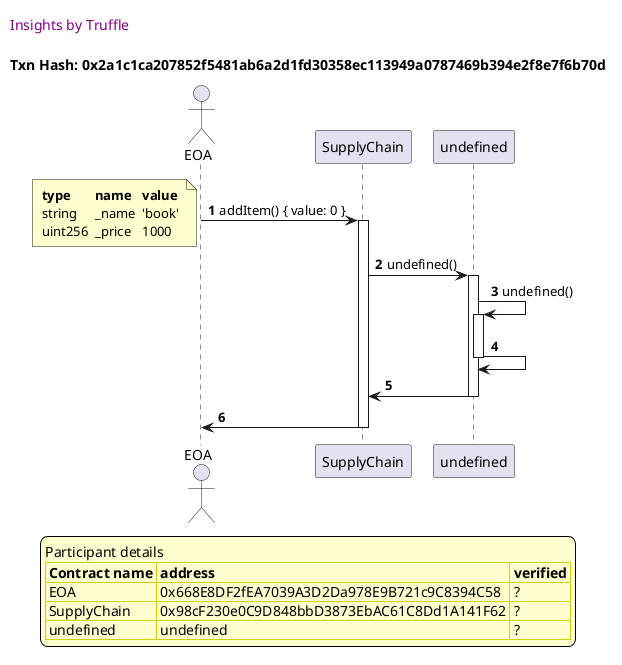

Tx: 0x8287f504721680fbb1acfe9a87396a524ffd8c264808f9f4767575b85d0528cd

### diagram 2

[SVG :telescope:](https://www.planttext.com/api/plantuml/svg/nPJFRgCm4CRlVefHzxAhRhK639YecotbZzhJLchlAuFjn0en2CogQTDttmb9ewHzWEN0m7ZqpUUV1su69tethXj2nEXQEwuhrHCoh8pjH2_MqAY5il9MrAj5tuvMPctJzl2bBCeYAmYv7jocKND2baf8rSCh0RXhU_FIMYUQj34BkrRMeOnsk5HYUg_GZNtNg4FgqRmey1Y-FGWfZLs0HyaRglzubt_NlxU3MIpT0DK6dlfHQzGWphX6mTEpXJinB6T0dxdFOnrI5ljUnAckAa_KMYM2nq4IYT1dMajU-n7ZbEj4ipYAmpYiU2XfwFDQ8etQeSlYTmfYW0kC5mI1E5ERJk1-7iUkQpRPKXZxXtfJpKdgl1QfAMsiak-LnyG58RiEL_EFUfUNCwZ6pRrJww_Vu1N-YcPKC_0ffV16RElKHFHu3jU7X--7ED_-1BVf562qOZt5IGEsP0kZiSuF8zZ2i1hnJZ6BXmmxNK8-M45pPnlOMJicJirvUtDdnPztTdKrW__JOYAzMo9aFzJauUIGf7B2DCC9oPpcs6v7CiCHxN4WZYXnI7ir31DLrHjjb4I4rqVuKo_a-fo5t5DLcR20fd7e5rg8862AbN4QrJ4BqqGooP8GYt-TAvpudvGINfT-G1NDafmpNbLvWCDSL6aMUHdFfPTwp2iZ_xFIaTQa4qMyu7dfwoADQP2aGUxd8ebvaTpYnr8d6GyIXhOFEeZf00kl6uoxNyK_)


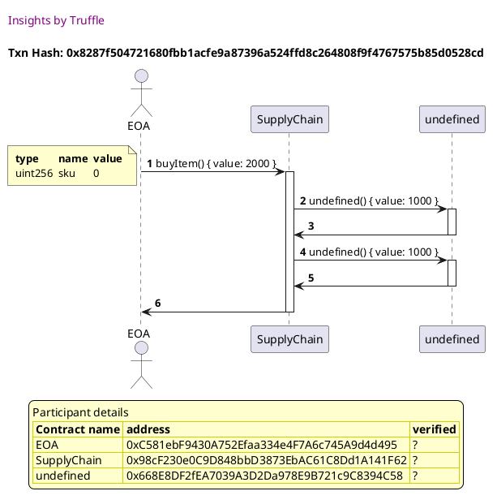


## should error when not enough value is sent when purchasing an item
Tx: 0x170803b701aeee6e07eb0b75126f0216f001a47654e876667d3888142034e598

### diagram 1

[SVG :telescope:](https://www.planttext.com/api/plantuml/svg/fLHDJ-Cm4BtxLupO0xjYqThvTAekK9fKS5eak2CtcRGMgHCvpef2-UyxIJ_Kmd5po3ZpHizltenoqpfbNRUg65ETgqstcgDbh7tHfb5MhQ321PhYLkKl2rjtffZMLMtXsooRPTECiN7hrXLUCRP4LQ25TmPmLrlzLXkdgacb5sQ5nX5DwGYQKNhBq7IsgN2NUjHl22AWhmTL5DeiG73sGUo_zlHx_dlJwiNIjJ1VmvFjof8ucDEkGdXwDN2dskK8-Ak8kUJ-FEP28MA4FCOvdyUXyAAIUu9UX0Hn50OeuoYAuiANKeh0utw0OIB9ZToHokpF15GBPnJF61dYTAuRHVqyTarJhQTBfSqp5qFDKUgqbbp3KXiizfM7n1bZ_GsNLv_vBYv6G4xSErnz_m7ly5TL7L9ZyC5CxN2myp24yUxmSnUlDh_1hHi4YaQjXZWGm8Pje7MsDtW3priCpkTr_N8-O9qspWkZ7coipdjKSCu9ens0_cR6FYabxIVzzSeF2TBEJj3_gxwy77sj-Aodh_cgSR2vXnZRRZHxE9fGWKxfgZroCkKfDTuxEQNzjBGD1ojfBXRRTd0LhIur5cJG-63-SDU6bZ2AP2RJcLTcavZxoSHFlLGbiSoIszWJUJALVX9CGqd5rwSCH_e79f586HPvaCzI8Rn4UhJ9lXVxOPZmA4WdKeMHcWJubUdW5foUhxSptNb1pmt5_ZVm3m00)


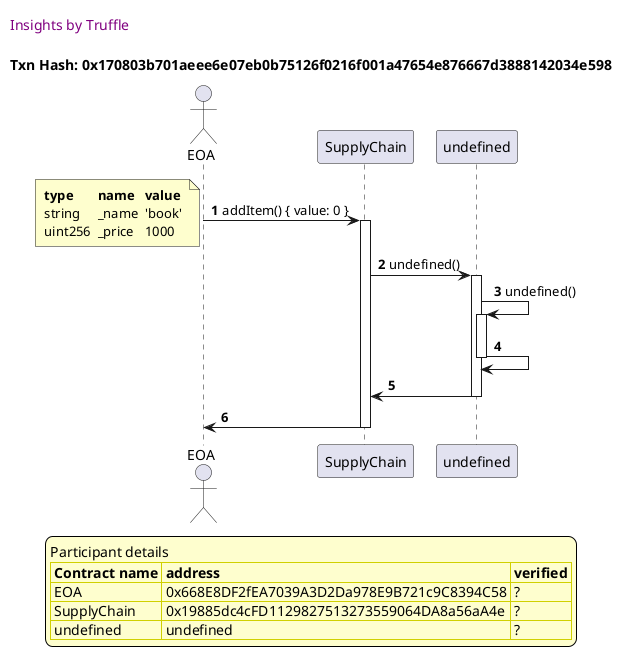

Tx: 0xe6187f0d83406b0fb1ceeb9e0bd1895b55d6f92256be8dfbeba3c332147cec05

### diagram 2

[SVG :telescope:](https://www.planttext.com/api/plantuml/svg/PPDHRvim58NV_IkixcNJriu633Zgkj80QfzMgNsV3BuaLeb1nbH9c_xttT0qIZeUk72vV9npRAu7hvmVLoqXQlIT7LSLE4A69sDxvTIAjh00gszK_RHmtMZrl6ixHx-KHLdC2q8k1xzfuOgG9IWDZhuIIcyxPruwwrMRjMPXLs0zOXgFZqfilnFwqVKjx5iFvWKeZ_3kNcbjx89oHjwG_lC3_y6_iuDPBFr0gmrzT6FJ88DuurkWZsjBRzMmd56sXfYdISDq6aOihbXJyHgWai0gpLCfAY5qtCWW4745gMugg5HOXs70ewI6cWbCe_QeilYJKJNGCwnd10FnfZQzGZyFOz-tc_bI6VkNyMdcg7KwYwb1OopeZyb3uuoGtHVEhpxpld-VqMhSt7bOVVr6N-cpQaUOKKxVYEqyJ74U5k5oV_5ZNw-slwZVz42nMhMQwWIWMxAbex4UVTCj7Pv6F3FiuWhJ7PUGJpfGsOdwdQv3uqGPOmp5dGolp_5rz3UZ3fx1-OkB2w81WpNF2ZqSpnxtJoNWqhzlGN9_5Aa6hqmx75dFMOuITjRdkA4SqWxUSKiv68Of1d2cCQ3Hy-KXhMcLCOZrNAGSgb968SiI4HIDKc4OGLGcMLmdaSYaZdGa1Gx_FYKSQPv8NAQfq7LKbpddWKo3HF0mI48X98kZF4kLY5KMmV-aGoeJ9uxJ8itBe2coX8Ko2_CWLp992tcJ1BoMypIK4ShUSp2cVLXuN6FT_TZ_0000)


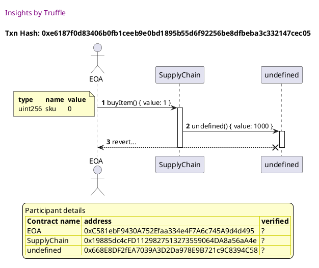


## should emit LogSold event when and item is purchased
Tx: 0x1b681bc7ed6f25aa21f147cfeab1d628fcb3be40af8d27b9fea23408db3572df

### diagram 1

[SVG :telescope:](https://www.planttext.com/api/plantuml/svg/fLHDJ-Cm4BtxLuow1tR5easSxweBb2GLd1O9xiY9xTOYSIB7ML4e_tqdwOTQUjnSnfutUdxpPfJRpZ9Z-xeYXFMsqNrT24D8zwfqomoheH9BeVaTAr-NfkarJvkgCV1jaI_oD2Tarjbr9Qu9MGd6XO4F0d3V6FNUQCkgUQMMkXRQ8esq22qmlMLeUzDMOfTwKky2N1zlZunpfPVWEkGJsN_jwVVy3xfJovNje5Z3i-cbH0vYbQq4FBzfk6VTQWhEcrk4iLkKaU2Xf05Zr9Mk7vLIiCBb8OrbMNY5y1qcOqwZ8a60UhuJyy8B8iebkb5QL9d_cGFhO89nGj0GgqhLCkpdgM_RQfskcD8lZZlM7ALEQz4r8PKMV5zvI4m86LwuklxATtav1NJYmOhw-m_uWB-iwWKs1fz4DrQCTXw6CDiTVkxYzUOts7Kh0ADczHX70jYG3NJM30Plu6MBmKNHDAyN8zOhRMaG3c1hL3cWhkCuYE4EmF0o8L-KelQJ_WRbXmHg9oVe_rLVNKtFAxxg6MhEDOus3n0XsuqcZqSJui8oLNL7JcPEXeqFJgQudmQtuM0bpiM8hXjT5KP99JWQD3kOFxwrmIKCmpYFimML-Jnol6JkPJHZIHJdoLr4tJ99Oo_nqo36ufjJXYFz8rCGfAadCZ_p_02NDCL8evmcKUv7iHVuD0kfLqJodEdW5foURxOptNc1tot6uJVm3m00)


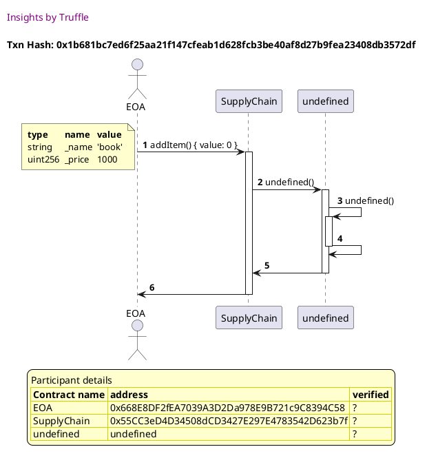

Tx: 0xb2b63b2ae3d6dd11ef1a30388b2a51dc9d127b77d087b70e3e1c27459b5203a1

### diagram 2

[SVG :telescope:](https://www.planttext.com/api/plantuml/svg/nPJFRjim3CRlUWgYkspeYicI_mPTLzTsq9vMeBqFiaKdGXtPiEMXQTDt7-EaGT8-m7mmROhu-EadGjU3KxqRLmrZQdIj7LSbzemDJyPsgbShQ721Lj-ewcdHjwFLMTkqFNoP5_CYAnYx7DowmIl6bgWqzl3A06xRthoqrgacRSp2hj0wagaTBSqflLFenhvhS9zwC2y8daz_zqfhOnVWSVP6wZ_UvT_rx-nW5aitGBc6ntwiQz9WphW6uV7PmgqQbZFWpwKeGraAXLA7MdiUrfwINCOnvG9FLudsH5H6aUOn1OuIlKf4Vf2KWU1IUKIZSkIo-9s26k2CuXaZ8CvKfbEqduUnwvfrjbJ6_k7UL7EKEgqbQbWRY_gzyf0uOspRuUBgezxv-GpASNtdSFNr6xp2NzMCE0F1EOStPbk74z73ELpkFxxluzNc9xXrXq3HgjKK9mtOi0sCnZeHXB21uMcaDwSi7J9iTHdxO8NCdMnWQ-sGE3RdxSoT57_UsSN53FvFYudqTecntL2p-wD3qkYKQOOZaZdFgTsMP4OZsjD0753IaFOu31DLx4rjK1F2omFygHTnVSw2sCDodlYIfr4WYbefANtqvr4QLZHlQQ9zxIS15VywLJZoFoa5GPP9pFrS-W6FTKPHH8L8eiAFOXdu8W-5BAFwizA1rgGJXd4HvtDH5sd4PPBANEGgYU8YkOc4LoLPB1EVREzr2DCU5ZtN5BTNnJy0)


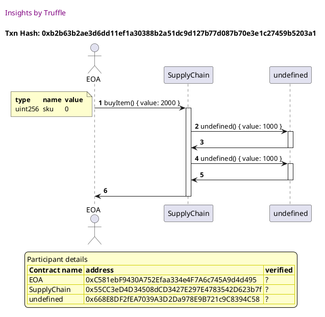


## should revert when someone that is not the seller tries to call shipItem()
Tx: 0x1360055ef3a7c2c952f75a43918c1839f3d3ff1910eeb94956c9599714499aee

### diagram 1

[SVG :telescope:](https://www.planttext.com/api/plantuml/svg/fLHDJ-Cm4BtxLupO0xjYgtM-uue5cZOLd1O9xiXDngr5waIEiw9G_ljEqbArSDnS9fdtzFpcUPIRradhkdN5cEnSRRhr0YrZxRCsZRHo3HKkqPIPB9wNjkvCEQshsiAtUJxFfpbZbwtRL7Z5s0fbYHRU6C1jRVLhRPoi9fLUcZKQHpBA4JIdzawXwMnJuRxre5yHl92-xcLPQhC4ZxDtKl_r8V-XVsTQlLov5XORUBITKgJ1d7OLmkEBWLlPhiR0NxmWvZoAK0KoAVn2HBvA8Xa6maiBBms42if0AKzu774XGX75n14YyS9G28caAGj7BlC_4v0jd54zOnI8quLk9Ctpq3LDjPckf3PFt1iuHwrJBgM6IXiiFvY7nXbZ_GcZgyzw5nTZe2Jk7Aw__u0t-2kh3camU6UcTZZ4URY4o_tBptszslu6jsaGg1gv7keW05ksXTRPFk0jFEqmE5_KzVFvW7NQE3-AUx2nkkXHZtDE6Eq0z2SpziafUJ-PhtT-Q91tTeB-7tiq6dzbVFRJSxvw76Bk8SPs6ytkZsweH2TrrHubEUCp6hnFSahxQMaR3b7IlLXiso5Lj5ffB2cWoqFumrbRMi8uJlDqDlTLFabu82R1p9z9aQIvo1BVAyIK5Z6SHYcHhqyLZlmFIWdFOfvdaoWBK4nAleYpC16OXhcliYWlf0gKdtlHLwL3Md3wVhsxqtqMzDnGxNy3_m00)


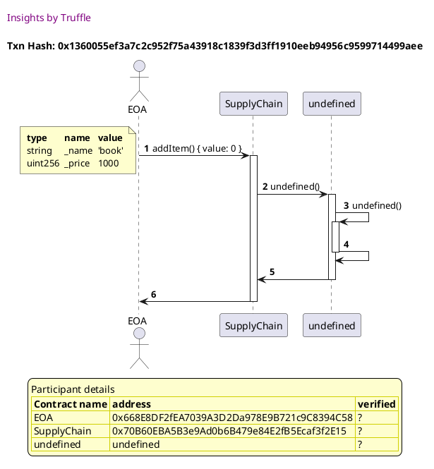

Tx: 0xbda185f9c097827eecc1a6626d18a2fd7ac9075bbe1e58b81c4bb53d44cf0560

### diagram 2

[SVG :telescope:](https://www.planttext.com/api/plantuml/svg/dPHDRvj048Rl-oj6wQLLQdM1vSjAqu2DbPmQARbN2pjhhu8N14iL9yv_xvWubftc50uCp8xUVUVPWQlUoSuDwvenERZ63kiIEyRw1sDRsSarrBX4gt9PFIoxPh1grjHD1ryMnQAO5OnTz6vJuoLZAvGAEtXc0DTDPvuQwsITrMPfrsWToMX7ImjAlogqGzVMk4_TcIS4Jz3RhLJAs2LudBsG-eyt-JVz6zkRvShrK6xWlXkq9WtcZAiHxXyjNCj-DGN-M2hf9Q5EAvx6YHyZLfKdeyYFb9T8NwjOLYcFmx943yEaJBnAb6KOA24gpSE84utAaSlYTmQoXpEAPuo0E5EPLb8_TqFRrflPIXhxXtjZpL7gj9QeeJOMrLlb8N76s6w7oULxlVFpAPJ3viRX-kitU8Q_iXvmIbGuXnTc6uSZqSCvNEmVlk_ZvVOdk4sBGD7AzHX73TYoBGp6EZ-CO0lzmq1tJbawPDZfClRE2faxQM1dxP3umDn9yV-TJIPJ-FGMdzSVCU-M67kTQ7PxT48AdJHrVuHnpkVKpWxZZEQpesauSAG9xR3lHwJO6MrG4R-B0_bnBuBwE0iJ3yj5AWAUnQ5VQ2c3GA1On5bKnIBCKYMKI4Cg_dMgSEH_L8fv7l4Ypy8ym3HJl8no4QUOYCBNULXKKWVQBxmFb0wqHfqeIefall1raSKyIBDWxiybVI55ciU-LwMp94W5sTxh4AOzBBgkAEx-4_y0)


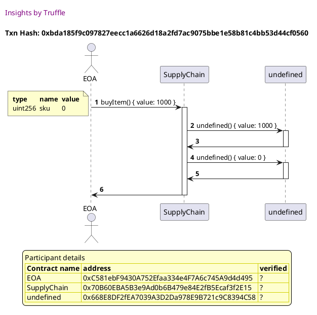

Tx: 0xd7bec76059db339282fab82a03d752178eb98bee1bd98c582c2ba3f17f4f935d

### diagram 3

[SVG :telescope:](https://www.planttext.com/api/plantuml/svg/NPDFRvj04CNl-ob6xgLL6dVvPy1otO23bPmQARbN2plOAyE2biMo4-UxTqnioma77Wp3qs_Um5rdXR5zNJ4cUjlelixHCDPjb6w54JLKk48jKr5iLgRfjLmqLMFWsp9RPekCiLbdznNE6LkZa6ZWZG4yD4QzDjgAAgdKIjUeBTcKbXujgVpXqFQchV1KUbQl28vFTqz2IgLNu73sJkw_plPd_qVTgTNQTf3luSNqPKaUp2fR8RpiD3o8RZq5lfDXZaKuuK4iSy-BtSWjHHwvWdio35mdZ32FenpHoMKS5K7a5cuklD89Ix-ClK1I6eKboknl0gA34Uc8KI1M5QeLDCzptxRLVh4MIl_Zpj1pLHenTdppTlwrx-Pc2jrQjOyMw-y_u0ssekgHYE6TwSRYaDCbtTdfukT9vuVVOFSj0gaMzQ230HpO0NgbhHjCu03TfgSpfogj3ew-Z7q1sTqI735EmU0MZHsFnqmY3QssWZ0-TrFy7vy1UxgAGA8LgkgkAE_vFUVyIBcWfHfoks3IMWrstK2CHfKA9U7DBeCDIHFpRX543kRBsFTuGglAIY4ypqT_6IQJ8lI399Q-zEE0clzyThXY7fn2davubYP1wc6SI9vFKZ-CCV8pjqo3h12bLxgPStQYyKv3qd57Ulmf_WC0)


## should allow the seller to mark the item as shipped
Tx: 0xee9406e4d4891f28c84ba18752a37f30d72f00403ce36651a26fe78fc94fedc8

### diagram 1

[SVG :telescope:](https://www.planttext.com/api/plantuml/svg/fLHDRzim3BthLn3PeHkwOF97RBdesYQEW_Qq0kszK6mg4Uh8XYmFJPl-zz7E1vBqE5yeyH5FZu-4xnedhMjN9MEoTPLfLtEqZ3MlsjJIoXMKk41JJ6J-kh1LQugqAYiBtsRPB4ipnguRjoxnXh4boW8jV320-yhgzyeuMOvBlJ0hD8veb2DeHkajGztQkiHTwac_8tWXtHvbKMYp08-pJsB_jQVVyp-OHY-Mhe7v6fvjgnHnCATTYV3yPk1UDiihu6-8ISWZ38jG99xoHIx2kVH4FF9b4Ak05x6lE0zva6CGHIDF-f72MAWy2HKMkI0tSaSgipzZa0qCA0uO6U9qhcj9_JorTLskqwNKveLxVSrHwhIMN4Eb3HRxoaDYm5Ztml3cdE_oyWh8YGU7g-y_u0F-oh95QWm-cQaSzdOUXd2zE_pSnPlDRt3h6e6YaQi-zWImOHjedEqCti3B5eEBULMzNlHOgutpHr47rbRd7UfnpWcZ7O3kPSREb9Bsa_uwvOS4QMSdwFzL3uTNNolEzNGrNpNsDdSGOzkDPez74ohGILqsHqvE-PGQxvnCQJyjRSF1IfgBnQRfNKMhbSQ23Be-cD-_jQ4bZ2AHYUdCLzauva4o3gR-L2Qno999x7jvaeeW2TEHeEBRKuOZ_JsJJ88e3tpfPVDGgN4QnIFXJUEHbtcPY48ndWZkPshsbUdW5foURxSptNb1tnt5xZVm3m00)


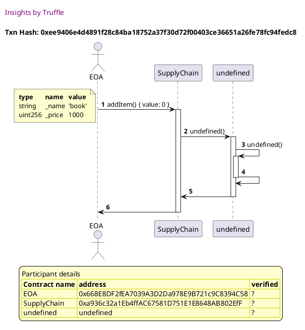

Tx: 0xf8be90c42bc0dc9984b6fadfa85aaad09168f8a9195925286a2c2dc7fe5a0d3a

### diagram 2

[SVG :telescope:](https://www.planttext.com/api/plantuml/svg/nPJFRjim3CRlUWgYkspeYid_hQ3hwZessjCAjFU1jgH4g2CRjZmqRVhkOvmqIDe7c0-cJH4_Vlf4w7fmsBjnrJ26esljkAfKpzZmP6o7FQwWKGjbvGtMJuk-7QtCswRjuKjPb4LUC7Ovk7MZhXXRAfIgXrS6SDlsvgMr3fkiCGkxKjOHHZjQAYcz8tHZtpLgdtemBmgyaFxkKKfZ5-1nzaRq7-_uT_wT7SnYwGQerl3OZreJWpdZ6WMFpnPkSLZEW3_hj5A2rw5VrLpMGgHX5MkK6jC84IKNNfpg58Kd8k57VXgZN_koJhIAaCi0oOtQaShYTmOum1d5CqQ6E5ER3ca_3sFNDUjyYSR-uTvKSvGwhINNb3PMoVVAG-ACiMs7YwkFlFFp6LJZ-iwfrTTly0f_iHdL37pEERmnsperENeuXylzn_TzlDhy1BVk552qk9hYn80Dsy1ehFEZ63OmF8tqvfIbGuOjbx4FKaZSoGQsqWw9Ot7UJjn9yUUTNLpCuF-qc9pUBZ6s6sfsVtH8KZaqpN3av9pFgTtMoPn6jAU1E5X9GzghOPXSLRtHHacoyF9W_jIBV7tEezHJLId2W6T9v1SQCGX25PP95jT966L2XZ8K4HN_EYKSwPz8A8Au3dpqYYhKEilZXD3p9F8AhqZZCCrkKaxyyZFfuDR4YUEqIEUbhuiiuO78Wha_Hv6aXRX9VAyMUHg8a6JlEMJJtYnwhYbkhuf_)


Tx: 0x6f1c14459411cbfa3c0729d17477c8dad81f9a5d1a1e42f4245eb48c975bdd08

### diagram 3

[SVG :telescope:](https://www.planttext.com/api/plantuml/svg/NP9DRzim38Rl-XL4TzdG5PFyAGTPLiTnq9vMeBqFiYKdGcpPaEIXQTF_FiPDWwm-Y1PDlthuKhVE2-l7hYL4ZButOrSfIuZRQJC8ApferKOPkHJrRcFxqSYYRtiBNzRbkYnAGkRExrkr86IhX5GMNWd0NM_rIs-yQFDMRqodZ4UPnkEdDQRV5ORH3gqwfHxrYm8MuUv1IAdD1XWbRwZ-uqF-G__UEBtPUWVL7fxis3IeGRpshOAdPmDtmcrdG9-JXjKiYk8iOgok6X7MD0qooT8eJMikXUIioKGicM0g2feeY69LHRpEqhYIad9qe_P8MVxEGJYumdX5q12lQpq8xETn78PsNso5DdyecsekKbU47F-yMNokkxwUWTlguTwhxkitU8M_eXqL4iCRCRrNaqzdT-Udb--dk3Zy1ByV560qeflY9007Se1H6n_42Hp0xKPSAMPnT73K9UGJ2A9DX3SpG7FVXqmUBXgKoWlTkWk65LrHIeyC1OxCea5d21oQLSvDFChgHYk9Xy_FsDDPX-DS4bxorJfeoZobOPQ7gs0bifINsJ8DM9qLFCoY8kPO_Ej_XGl-IKbaOLA7WM1b5JLDNYHfpDagZLd9Ifv4F5zo6fJD-gI4xPsQnESMu_7A_mC0)


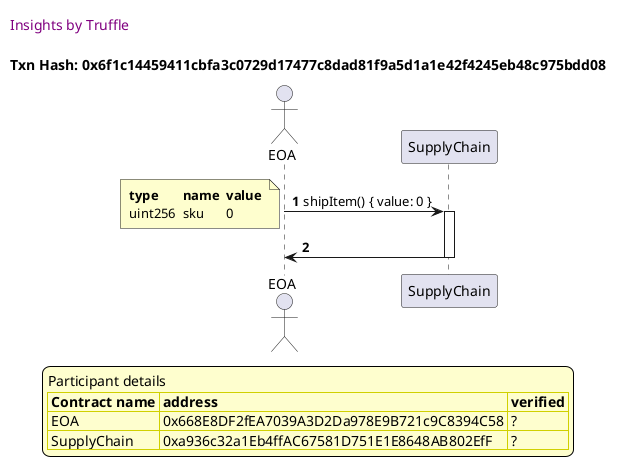


## should emit a LogShipped event when an item is shipped
Tx: 0x2626f2c4f33e5f1abfe2831af944d60bc10717d11089554b11c525b3c8a232a9

### diagram 1

[SVG :telescope:](https://www.planttext.com/api/plantuml/svg/fLHDJ-Cm4BtxLupO0xjYqThvJjK5GfeAJei4T-GaazOYTIB7ML4e_tqdwOTQE6ukOyyRFRzvCyfDPwMn_QfcJFQsqVqgHyDOzw9qAurSGOqBrEMjB5uMfkbrcJPrO-3RF9jdQSROjBFh6gyOMw8iqS0x0xXhZ7fhj9LrKgk5Ng6sH5DPWkQKtZAqlMbhtAKUrHk2yEZs8CjIwGK8pZw8_TUUViz_hpkrMDeEyZKycRwgY8DPPMk4frSDTx9RJe2_Ee4JL4xXLQwBVYLaNg4JkK9MiUUL0SyBmKCHbaBmAFPzBnUYy1q_Tuj8EguZOtAZiAGo-vE0xE2CuXaZGwmgL2kfdyU-RUjrkfHAFtCnrXobJcl9DQoKnd9VUKYSCJQyS7drcU_YOWBanBt5rVSVy0v_PTqZDGOVJ3SMHpiFGvZk3ZztyMhp6-owHQ2evMgC8m5is0OwQmQ3D_2ynU0yRvgNyn7hbRQE7mnWQrGne89pJXZj00mlC_P9AMa_wMzGVaYGTdQ2_b_rvUNaQyLdFKFDLusZpGF4s7QZsSFHX4gqKjNTaPCpFgF61oTJsaz3st2makPYiEj6Lz6eIc591aqFvezlRMW9Wo3AejdSgR8av6wSk3Dd9kCmokBRq155d4PkxAL-HCNNfmn7-aUcAdHzBdWoIsICQU2xLPY9W7jnadY1m2Xq8WnaWb-P3cx1wVbwEzET5_JTK1n-0_y0)


Tx: 0x7831213a29f5270453e6c4ed2b5ff2550a9e0d46e3d50314658c40c08c45c35f

### diagram 2

[SVG :telescope:](https://www.planttext.com/api/plantuml/svg/nPJFRjim3CRlUWgYkspeYicMv3z1rzLr7BId5MZlWs9JYL17DcnvQDhqtSSuQP2q3p0VH9iYFdxwYV1rxtNdXrNDc1vyuuRL73l6-YVhMjtf5TIuG5VTwF9fqJM3g_AcRZhuCYjcHLumTjdxTOrNZ2rHLzZ1AmEuRJhxqZYlwwos2xT2vqd6UDgQKNgdq0vTM-C-zM1V4099N_UwggnRGC3P6wd_U9T_rxzplLqiVG_pDJnsWp6amRprDSBZiuDRtIydm9_ZH0HX87IO6XN6N2g1KIcn2kVAc50fhbFabOnGL8gBG4OgAIKlEQsg5CeGZTAJo-9t1hg7CufdZ81uMzfMqtaUXhQjr_bIM_U71sFDKUgqbgYXiGwhzyf3ueonROUBguzwv-SJc0_hEu-hhz_W5VxgUi09X9npU6EkyJWIFTp3vVxb-pvURNw2NxS859rUZN7KW0tRm62T3rK46-YV1bevPUcIOQlBs0ShPExa05jhXyInkM1dxgJuyyakBYRmVrgCfBTRZEs6cjqVNLA5NjkwFo8vvLDgjoMPquXsD107b3Ia7VRzI1KxQonMXF3o07_iHLoVSvK4E9-bKl0iLc5Xj1P2efp5MLJ6KcLf9IkPAYh-TQfmv7zKCh5GFE3PDAFHpICbJ5m44PTfbiaem2GE4unqXf-L3hH6dIXAYcGw2qsHnLoacPY6Kvt6IP7Un65GfdaYKacszpg4QG-BdckAsr_5Fm00)


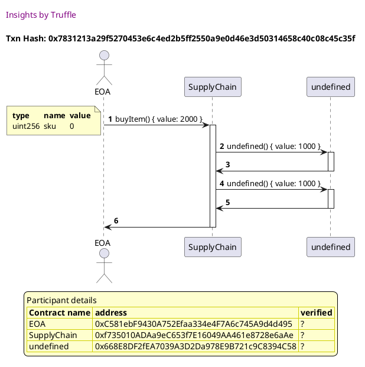

Tx: 0xccfc0cd777e50b285c0e0c3c93ff59997b25b60f5cec438f56cda683dc078214

### diagram 3

[SVG :telescope:](https://www.planttext.com/api/plantuml/svg/NPBVRvim483V_LUSkfTDNJK3uLUKPQM4g7rQfVPzSimviG86sMPAslH_tuMcKLOUE3ZCv-_kVEkyi7ve6yR4u3ipj2kqZBcjDhsmeeK6rsZgEo6tQziDfYwxfhFmPLajgx9YRERyli4vOniKDLfuPG3tdTKldV6YAHgzDYqQJnZbwTEIqk-4Vh1zWwVKatv122RqzYZgMfir19oz4Vt71_w3_s2SNc-yWzKUdksW536Orxv1UDuPk1TkCmM-ar99BkiqJJ7cgp2B9KSk8vb7IiLvdgUhC5ubNCKIvIJAL9p8MYHPL4kUPY6PC24zMLQ_2n0EhYXUCMg8rrBtWkfv6lg-sPSReSqV7enhBb9NZ1t_l9b_NdTzFGMtqVs3n_RhDtY5lw8Pa8pXZPdEuzYdStTdfuVlfpW__0I_xn4e6j6ESGJ0WHrWqCQ7SG87SDk1xfooD3euSXdx949ge-7D5AYvxqDcZnS5rkY5Rjo5mu8lEET7Xv96Pgb1PmaQcaNdHX-qMcciQVFPMNlSYunsIP9LsM8Pggf8UPGNqI9SY3pDglmk3GEPbrcKJyeueyM__YTS-8yabKOn3tYnA4IEPH97Ags2X4_oefWa0MPfc64Y2ZoHgBnJaNJTKZmU-Ny0)


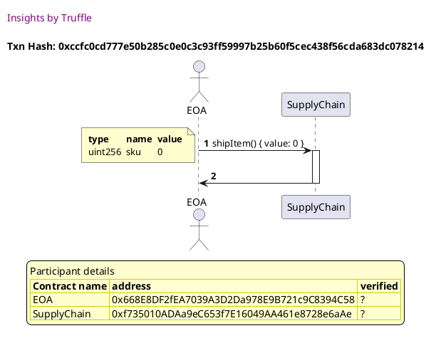


## should allow the buyer to mark the item as received
Tx: 0xc85bc1789c44b847f83cf6ec6b35d39f0ef525f568610d7d3d3a7e277745e8b4

### diagram 1

[SVG :telescope:](https://www.planttext.com/api/plantuml/svg/fLJBRjim4BppAnRk8IrIevIe1sMuJloGaPmQ8Ba7b4ZPX6LAeAWYJfn_xqfs33ivLfSbTnR3sTc5RXidh6kt9I6YTPLfjvcoX3GRRMfXnHPAjL96paI-MTcgDN9UbPM5RyjqcSvJGiQDsvLgGiXQ2Qail160kyhgryeuKKvBlJ9RPHpI50wX9QOF37Lhwr8TKu_wLO4NuEr1IAdD2ZnAtf7zrmVz1_-zQVHgxHh8Tl1asw903kAqAnKylHYu4yrw1FGbvs6MUp5FyY38U10NdEL5fF8eOw5aIK5L4VfX4KOyygYC9PDCnCgFupW85Sy2T2Dtg3BzCmNHm03ZWA0XJkUw5jZFOrlNvMw-5jeyKw-lEKjTrg9hgj16oO_AKs90IFV2SFAPx_fw1EZ4lLFRxp_W3VwAibNO6BmJKpdLstaQmlXu-7cCa_rlSBjQ0KOZjdti2M1Fzj0usncyX-S31bTPLMskUgpLnlbXr86rrNc7UfHIn707e7kPa4zAKVj5VvtoKmAramlq_wg7mz7NYizwkfgl6dkREuYGmqQJXxC9IUM4Bfip9nTqWOrtJivnForkmybAd8jLJTExggmkj99eqFXaVl_M7fSmYdZA5qk_IASnPScKBVo5I6AU9hFOz_9apbaIp4EEnJUN36VwUwOmdsKqe9BwF6ECvuMNCPvGdqL-u37VJvUSJkbCVMKwkGMNvvl3J8zUu7UBiViD_0C0)


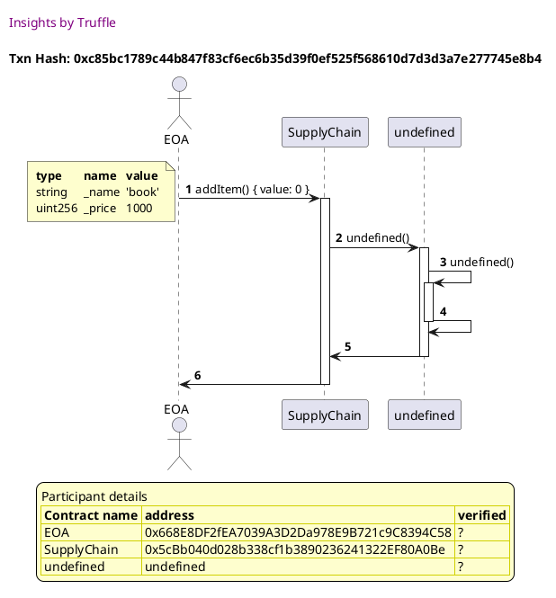

Tx: 0xb93dcd3735c0c450ffa624807ea58ab038d9b4fb0fa1c2306f372d5137f4d406

### diagram 2

[SVG :telescope:](https://www.planttext.com/api/plantuml/svg/nPJBRjim44Nt_8g1kscH6gL8FGqtZMnBI5ODaEmBIYHjmZ8bI5GH9yw_Tom_O2SVK2qqqd1mv_9mmBlEYTRrcueGqRlQzfj2jOHqQsCRqOeDL6gfh9o9ShriwzxAULtLBNp9ipoRPuHCExUjr2qXAoMaQk6D0DpNhNcjhHDLMfcbtIZhK4OxNCenVL1e-hQfr37rP5uLU3x-FGefZLs2HyaxglyuoP_q7sndbYlNGR65vxRN6ZM8CwvIyFnYuLvqgmdGboBXifGyua59Ip-WMekG-J6Db0XYKL0UowJmTK6ry4h6QQXvn6JWyKZxqgSXqYWTkin-fo0w664S4GJYJ6aQWVjvwfkcsivNmjW_r1jgBbBNjKXDQMELF5MU4oD2zXt6jn_rRcucKFJR1wSsNx_16_mLLQycm2Yby4vixTH0z7mEq-F7zsEytVq4jsqKOBHYCyH10tPa1xsnZWKXxA1Rz_YccCL3Xhqk8H-ieBch3UojdHENvho3kQlYppiRZoVmVreCfFTBX1o6cZnU799KJfYgko2ve0jijoSvnn5jSI3EA758MzLr0rNL6csKH8JJC_oX5t9zcGUnfueyyJbDeu1bMWZEVUNdKHgMaH-aYSHvIm8i_dMjSE5_K0hAMK5zAYcB2yxZKdi5ZnFAECwrnndByfYcTAO-Avrf3JfX66Vn8cSwIoFAavGls48aKPmbiuXvPJAFUUAZxQCEOZh2mkSEu_wg-0S0)


Tx: 0x81156a84e5d3288879da64eabc8a557a922bfe0c7b99680f13ee00fa0cf4adf4

### diagram 3

[SVG :telescope:](https://www.planttext.com/api/plantuml/svg/NPBVRvim4CVV_LUSifTDNJLZVfaeoveGelPfbThtoS2HM063i9cIDltVTw5fb9K77pwEhp_tFTzPftetD3LZQd2j6PeSUyRiJfjEzQg16ZTeogKgTfk-7KoPjdNRmvTrjixIZB6PTOSQvunjKPNOmoi3k6zx_T8Qf-f5hJUcGUD8fdBqQKtfTuLkwBiQpwad_OBW1RHxL6MfpGOypjv8_SU7_8V-Wx5witKMyWCyzqDLaGPpsjK8pti3zyfkfy3tqlF2ICa0mz8NKieuALKKeCeBgS8mLeaGUOMyYFCaYIIlF1-HyqhneWfKMGNaHk68Clkz06LXGd72o12d2zqfwkTfwBhwa6wLDd-uDzPSfIQCdVwydN-kkxcPWjtgxi5Xy_KRlC9VLGz8nF36JEjmzEdYxkpyylqSvyUVu0uT0aMZcZ6E0d1aHnYqSIACu0XsDz3AAKkZWvCkOvz026qal9q2cVi-PFPurM29JkdQNZ6i-8fpVc98QMGz6NI1eA7rQEt8WxskD9Pq-Eo2FPv5HFieafbShKMLBMBk9mj_9LOgYMMMB6FX5Kag_IH8Gqd5l_vNkE8VbS9YcVE0brp8tFTbKNcvBnCk_4W4dYz4jfPymPTuLgBspatISqVnTEN_0G00)


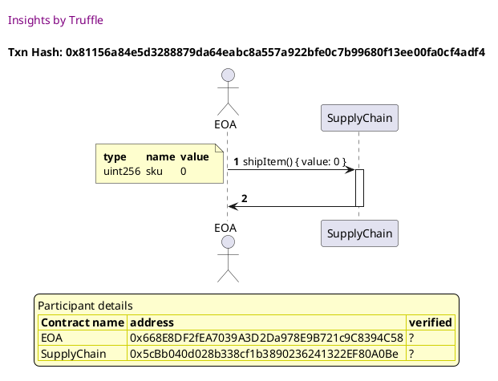

Tx: 0xde1f2202f536e9e482a688522c9400e8c03b2b912ca5037477f80993ca7a3fd4

### diagram 4

[SVG :telescope:](https://www.planttext.com/api/plantuml/svg/NPB1RgCm48RlVefHzhAhRhN6DW6YRBOaJTIUjb9xNnaO4YjWa35LqgRltWbDesmvUF0m_Fxc7zzqNZlVrnLZklUDxUiC7MFTrjXMErr3XMkqnLpdsxLhUbiicgfny6srN2qNIyQcdTzNE6DiWxf01wyCuAvnvgMnNbTfPTQsHkj9flJqQKNf3uMsTss5fzIZUK485EqUT54OkuQ0ipTI__Kf_wb_RpkptlWEiZqykRuiIODvuok4fvs5Ezrj9i1t1GQb45oKeHnZWYeMUXp7eH1veZZ7EESo4raIY5o7N4OgYigO9udCTQHbMIXo8_T4kVoRWkvWH774o11lSjDgwkUnRzjglzXeO__nOAYvI8qOE_vvFVjQTtKr0OSvccUyzrX__m6lyAoh7WaQtfXjF0vMdGsUdbv-dkBiy1lylaMWQ7Kzn4403km0lR5UX6CuGBVjQUMKfUd1KPUnBon4Dq1UJu3y_PWpUxZeiK2lJTLTCDpoMyxvaM51KtFaqHc2vkQmwmOUTAOqMD3XqpFsS1OHxHPX762sIfJaQHIAPQcrb0hLAah7UQJ2D2bKePAGYl_yht31FoY5-JpZYXTSn9cKSLu6cOmJBkHOg40AiLp5FELpF2bHUwScwRcXUBprxm00)


```plantuml
@startuml

autonumber

skinparam legendBackgroundColor #FEFECE

<style>

header {
  HorizontalAlignment left
  FontColor purple
  FontSize 14
  Padding 10
}

</style>


header Insights by Truffle

title Txn Hash: 0xde1f2202f536e9e482a688522c9400e8c03b2b912ca5037477f80993ca7a3fd4

actor EOA as "EOA"
participant SupplyChain_01 as "SupplyChain"

EOA -> SupplyChain_01 ++: receiveItem() { value: 0 }
note left #FEFECE
<#FEFECE,#FEFECE>|= type |= name |= value |
| uint256 | sku | 0 |
end note

SupplyChain_01 -> EOA --: 


legend
Participant details
<#FEFECE,#D0D000>|= Contract name |= address |= verified |
<#FEFECE>| EOA | 0xC581ebF9430A752Efaa334e4F7A6c745A9d4d495 | ? |
<#FEFECE>| SupplyChain | 0x5cBb040d028b338cf1b3890236241322EF80A0Be | ? |
endlegend


@enduml
```


## should revert if an address other than the buyer calls receiveItem()
Tx: 0x45ea42b1c3367f8dd5c60017ae3e43ad6203f181fe56a3a7c8d49c83275807cc

### diagram 1

[SVG :telescope:](https://www.planttext.com/api/plantuml/svg/fLJBRjim4BppAnRk8IrIenJrDbmdZYGZEJL0SWzeaR89ovH0KKMSEF_UbVo07yVgikJEOZWxkz1zOxcnxReaXBUsqkrwBWqXpKhfcXk-Xb8kf1OFF5yjJDLgaLHbPU3RB9jbIKR8kB6RKau8MKekf85F0l1O6VLHQSlBQQaMUYsrHPh28ZJ3z8wXRarTodtgHNr8S3oyFNCXb5w0GyaNilywq1_udtIZ5alRm7m3hwOj2kGWLjbImkkxXaVUB4T0tprVSe_DdTnrWx28XF3pW58dvDALdij5mAXRE95JI3_WBW_pI7Xn7haiz2CQvZcwaLjKcVsP0czWW750q12hSbLpxEUbhUjoaoovqc_KwMjEKkUrw9eib9RYK7bC30ZfNXXEBlbkRqU0JZnPkVx-0pxXBozRYOt15z6LbRsTno6CzuUV-pZP_WQxgILWr7pTnvu0jcGBZJMTmLjuss5mCw-grKsFjKfRvWSTM1kLTwX3AKKCTm2wbmcvK8hQp_hhb1yJg9sSeVzNFHoEhYikzNGrrnfxcpk8aDr6a-UJ2GbfkIgR4oTJccBZdPC9xgV1RJXQYNCnicbwLwLHXP823HeVpU_Vsk8I1a6KHUcC5Taqf6uyTLEMyZYCilWXP4uU9v4RUuaVOV7TESE9_fx9oKGeWZHcJCoza0dXKCOec_bkaASiOTJZF4m3_vhfw1QSd-zsCzrxWTyznkuty0y0)


```plantuml
@startuml

autonumber

skinparam legendBackgroundColor #FEFECE

<style>

header {
  HorizontalAlignment left
  FontColor purple
  FontSize 14
  Padding 10
}

</style>


header Insights by Truffle

title Txn Hash: 0x45ea42b1c3367f8dd5c60017ae3e43ad6203f181fe56a3a7c8d49c83275807cc

actor EOA as "EOA"
participant SupplyChain_01 as "SupplyChain"
participant undefined_01 as "undefined"

EOA -> SupplyChain_01 ++: addItem() { value: 0 }
note left #FEFECE
<#FEFECE,#FEFECE>|= type |= name |= value |
| string | _name | 'book' |
| uint256 | _price | 1000 |
end note

SupplyChain_01 -> undefined_01 ++: undefined() 
undefined_01 -> undefined_01 ++: undefined() 
undefined_01 -> undefined_01 --: 
undefined_01 -> SupplyChain_01 --: 
SupplyChain_01 -> EOA --: 


legend
Participant details
<#FEFECE,#D0D000>|= Contract name |= address |= verified |
<#FEFECE>| EOA | 0x668E8DF2fEA7039A3D2Da978E9B721c9C8394C58 | ? |
<#FEFECE>| SupplyChain | 0x1Ed7d6D922db472dd102202F536cD2C204aa7D65 | ? |
<#FEFECE>| undefined | undefined | ? |
endlegend


@enduml
```

Tx: 0x9cbdf317b178619f0fd928e313d48d20984bac4ea989d8cec563faccdd8b34a3

### diagram 2

[SVG :telescope:](https://www.planttext.com/api/plantuml/svg/nPJBRjim44Nt_8f1kccH1gKewa73JQFeWMJL0Cc-e4JA9YnJWaGLSUByUyUoOzXfzzL28mq7TouF1xmPdEpTk6u8aQDhxRWkTK_8i3AsaxrSGwCNsgfRMQqMVJjQbRPDsyEd8Y_oD2TaFhXDewy9MMgfT0-l1E2kxSrBQvriaiOix5fRXpArmwK2qtk5RkoxHXzIZ-P5WyVnxq4gPUm2F4hUKFtRk_ox_hqTp6Bf1YWtyDIFTOqQn1dNQ7Xwjd0dX-KCwBEeIbNxNbHwKHnwegQr4YpMlkSh7Yj6HSnBMN4jHInKNEag2FrQLfLISUbpwIEDog7B_6S2Se0BZ1S4WJXJcKxYVXx7hciswL8Q-ujwKyr9whmMgUdQMAtUAu-92q9s7QwkF-fTNiwW73VtJgy_Vu5N-2sRKS-0KKhXZTZMwOdeyHpcXu-lXtYz_Gvkqsd0QELwYfC6RCaMHcCT2qBOmh0QyKqnYuSCErr2FbX1SsSRs5ax9axDUNjpPyL_x-pgQWR_fyL4UhT4o7weoSF98Idjf6c64v8PpR3TZcIA8zhZG1nHuf3sUXWcghetjT4A4SwFyATUoFKv3M9FbuNWFasYWEMrbBxFDI-Y9AmY7YH2SSL5WCK_pXLE_4zANguY5MQ2CLNoY2dbKSOeAm8_h3AMCigbZBBm7qf7MfDE6CPvd1MipfE8-YBnCvP94SMvk8sOLuaqzWL7smSTn7I0XSyDnjrLyGS0)


```plantuml
@startuml

autonumber

skinparam legendBackgroundColor #FEFECE

<style>

header {
  HorizontalAlignment left
  FontColor purple
  FontSize 14
  Padding 10
}

</style>


header Insights by Truffle

title Txn Hash: 0x9cbdf317b178619f0fd928e313d48d20984bac4ea989d8cec563faccdd8b34a3

actor EOA as "EOA"
participant SupplyChain_01 as "SupplyChain"
participant undefined_01 as "undefined"

EOA -> SupplyChain_01 ++: buyItem() { value: 2000 }
note left #FEFECE
<#FEFECE,#FEFECE>|= type |= name |= value |
| uint256 | sku | 0 |
end note

SupplyChain_01 -> undefined_01 ++: undefined() { value: 1000 }
undefined_01 -> SupplyChain_01 --: 
SupplyChain_01 -> undefined_01 ++: undefined() { value: 1000 }
undefined_01 -> SupplyChain_01 --: 
SupplyChain_01 -> EOA --: 


legend
Participant details
<#FEFECE,#D0D000>|= Contract name |= address |= verified |
<#FEFECE>| EOA | 0xC581ebF9430A752Efaa334e4F7A6c745A9d4d495 | ? |
<#FEFECE>| SupplyChain | 0x1Ed7d6D922db472dd102202F536cD2C204aa7D65 | ? |
<#FEFECE>| undefined | 0x668E8DF2fEA7039A3D2Da978E9B721c9C8394C58 | ? |
endlegend


@enduml
```

Tx: 0xe51fd2dee9c47385836fd1a30247c57c8311885c0dea2f05a1ba2646887bc7ef

### diagram 3

[SVG :telescope:](https://www.planttext.com/api/plantuml/svg/NP9DRwCm48Rl_XMZzBAhRhN6V9aecsqAHErfAxNtoi4ciG86sMQLjEb_tmbDesmvUF0ml7xc7TywBwmVseOGCVZE3ErAMKBSLfjUMD52ezRAo3jHRTUs6upCkwQpSBKibsLU4Z9pVj-eEI4R9QIoy4O0xZkhNplZHRDezDgqodYKgJr-McBwGw4VRD-eK-f9loe88jmz2YcrMKD0oJkg__oK_zH_C4wlDzx1QW_FTgXhr21U-qR1yyx0lN2RAT2TYeDQCgbKLaLfo6CU9hKCH4XPb5PnMl4m23YFAogLO3MDHR0IB8aIpjDLbQeQtQWyKfP_5Y0SJ31E21hYTQLxWVqy3NtVxFEDqEQ51cFDHMf2oF7Fc_dNkklhARYDxX-yQhzzXpVuAvf18J6y4zDvDVfqTdTsUlbnYlF3B_3xNW568zenZW9m80SOjF4iJk00RZlWIZ6BeuEZBY5VG11j9BoP0fhxCMJoUD6WL5xenbqm5BIWb1uPSXoPHOFE43WqgvmRUPJLjLOI3v-TiSUpa6YN9BpanPBLvIAbORO82rQ8BELbTfUoeCfo7cPH7dCi_ls_mWN_g1IKCfL9aJ4cLr7Af0meOvGjup2f2fOp6WcH5abyKiBsJatYSulnUEN_0G00)


```plantuml
@startuml

autonumber

skinparam legendBackgroundColor #FEFECE

<style>

header {
  HorizontalAlignment left
  FontColor purple
  FontSize 14
  Padding 10
}

</style>


header Insights by Truffle

title Txn Hash: 0xe51fd2dee9c47385836fd1a30247c57c8311885c0dea2f05a1ba2646887bc7ef

actor EOA as "EOA"
participant SupplyChain_01 as "SupplyChain"

EOA -> SupplyChain_01 ++: shipItem() { value: 0 }
note left #FEFECE
<#FEFECE,#FEFECE>|= type |= name |= value |
| uint256 | sku | 0 |
end note

SupplyChain_01 -> EOA --: 


legend
Participant details
<#FEFECE,#D0D000>|= Contract name |= address |= verified |
<#FEFECE>| EOA | 0x668E8DF2fEA7039A3D2Da978E9B721c9C8394C58 | ? |
<#FEFECE>| SupplyChain | 0x1Ed7d6D922db472dd102202F536cD2C204aa7D65 | ? |
endlegend


@enduml
```

Tx: 0x101b32e5d9b1601076977a670ae433fe679593096fea9388ae6e2fc3c39d245e

### diagram 4

[SVG :telescope:](https://www.planttext.com/api/plantuml/svg/NPFVJwD0483Vzw-OU2ztyUmjoyyrdcS56dqw4ts_RDcXtKWNiYnDg_L_lodMfie30yFmvPiPkEczSdvODOofmRTsMCtHCTO_6ziffrRGu0AjlbNLyyArWzLvsxGElitAMPcNZ5trVjlWDMDBL1eTl3A0kzQPbzPwrKmRix0hj9umjQT7Cqg_4xh1TGqUKe_c1I68wEv1QMti0WBEteZ-wmF_mR-tlLaiVG_pBJoveQw9mRpn3SBJniATwfUNm3S13-QXm5ZBUP3mWAU9J5ELf5nX58Or9gcCPSXbKgEIOPOfJ53KLLY5Keie9gQgF5cMVwUWUZYZUCPe8DvKfbFKp-FGTSqsNofZ__5Wh3b9dJ6sV_FY-clT-VabEApGhF7Uu-hx3tY5jMe696buOxRrE8xgEE2hmyNFGxpU_GQ_xH0eMhKQumY07Tl1OAmNSG8xw9y7EdFAqlPWpsNiYylcWln8Ss-qHkSdamdJI7sRjIADpzMqWVSlWJsSJ46ZLwRfJomBNd3EzvOvxTKHxQX9ctNOzwCnEbCRrAHtTMni73OvRv8aAxDY9kfocl9GJiD254gcMIblKn5KCiz26ULnHiL_FXDEd4TIKEfK9uKKGi-ZL6WTS26ucCLXKXKY5pnIAYsI-42YzWvDqd53SVzV_0S0)


```plantuml
@startuml

autonumber

skinparam legendBackgroundColor #FEFECE

<style>

header {
  HorizontalAlignment left
  FontColor purple
  FontSize 14
  Padding 10
}

</style>


header Insights by Truffle

title Txn Hash: 0x101b32e5d9b1601076977a670ae433fe679593096fea9388ae6e2fc3c39d245e

actor EOA as "EOA"
participant SupplyChain_01 as "SupplyChain"

EOA -> SupplyChain_01 ++: receiveItem() { value: 0 }
note left #FEFECE
<#FEFECE,#FEFECE>|= type |= name |= value |
| uint256 | sku | 0 |
end note

SupplyChain_01 x--> EOA: revert...
deactivate SupplyChain_01


legend
Participant details
<#FEFECE,#D0D000>|= Contract name |= address |= verified |
<#FEFECE>| EOA | 0x668E8DF2fEA7039A3D2Da978E9B721c9C8394C58 | ? |
<#FEFECE>| SupplyChain | 0x1Ed7d6D922db472dd102202F536cD2C204aa7D65 | ? |
endlegend


@enduml
```


## should emit a LogReceived event when an item is received
Tx: 0x1ddeba541a4e76bbb8ac225df158a752356997b5cbf513284ad21ba7d4e83e24

### diagram 1

[SVG :telescope:](https://www.planttext.com/api/plantuml/svg/fLHDJ-Cm4BtxLupO0xjYqSRvT10Bb3GLd1O9xcWIEwr5waIEiw9G_ljEqW-rSDnSnfutUdxpPfIRpg5r_R9c37lNc7vPACjOzw9DYnQNKAkvCl8MovUvRNeZiwPkB7oRvRCyoncxxDogLbUCBHHAPU6T0TmrLhyrnc4zgVNSB9LnH5CvWcQKtZ2qlMrhjKqzwZS5FAJR0qgfpHounpw8_TUEViT_RpezNxWEYXKysRwgY8CvxMe5Jwy6xh1RN83togLK1KOXnr0bSL4K0alVZsJ58u59v0THdAP94PL55V705o5AdnUOo529GFaXkL4wKfd_cG1sS4BnX94XJfUwHUhdiM_RUfKjK9jdZuyr1wdZMd9DLTeekQlS9quO6ruul_hCTtPs0UJ4lLFBxp_W7VvYtIjg33wOQPmQxTmFuN9x-BcDL-lVu5Qj0ee6bsCS2M3Drj0vEnYyXkSD1gT5qxoSZbYlZVEZU01Rgyi1vPxd4KOx0CFBZ7rIIjgF-XkKxnEadHsX_rTzVdxnjUApdg7cgyRHvW5YRBFHxE5WGb8vr7LtuEJKcrBZWvCPxQUbRTXRINEngkj6LvNLbLQI3BhScp--jQObZ6EHY-dCh_99uWNf99ZwKqmJaQUtYS_BD1D16cQHeEBhOuO3_IDJWgbCgYJCPg8AOXL97dbJ7gSYyp4G9KSl3qHmMtvbshi5n-VhpKotNj1tGt7u3Vm3)


```plantuml
@startuml

autonumber

skinparam legendBackgroundColor #FEFECE

<style>

header {
  HorizontalAlignment left
  FontColor purple
  FontSize 14
  Padding 10
}

</style>


header Insights by Truffle

title Txn Hash: 0x1ddeba541a4e76bbb8ac225df158a752356997b5cbf513284ad21ba7d4e83e24

actor EOA as "EOA"
participant SupplyChain_01 as "SupplyChain"
participant undefined_01 as "undefined"

EOA -> SupplyChain_01 ++: addItem() { value: 0 }
note left #FEFECE
<#FEFECE,#FEFECE>|= type |= name |= value |
| string | _name | 'book' |
| uint256 | _price | 1000 |
end note

SupplyChain_01 -> undefined_01 ++: undefined() 
undefined_01 -> undefined_01 ++: undefined() 
undefined_01 -> undefined_01 --: 
undefined_01 -> SupplyChain_01 --: 
SupplyChain_01 -> EOA --: 


legend
Participant details
<#FEFECE,#D0D000>|= Contract name |= address |= verified |
<#FEFECE>| EOA | 0x668E8DF2fEA7039A3D2Da978E9B721c9C8394C58 | ? |
<#FEFECE>| SupplyChain | 0x7a9d7f74CF8f36e5d150D1698C2a38c1a0E383Bc | ? |
<#FEFECE>| undefined | undefined | ? |
endlegend


@enduml
```

Tx: 0xaefbba27d925691596cf79567fd7ce65c518c0e37b097d11d9c7945d125ee082

### diagram 2

[SVG :telescope:](https://www.planttext.com/api/plantuml/svg/nPJFRjim3CRlUWgYkspeYib_PGLTLzUnqPvMeBqFiaKdGXtPiEMXQTDt7-EaGT8-m7mmROhu-EadGjU3KxqRLmrZQdIj7LSbzemDJyPsgbShQ721Lj-ewcdHjwFLMTkqFNmfyYBFSiOk1xTky8gn9IgDFRmoWDksDo-jTQf96xEmAxIEP6f7ImMbTmhTs7SDxbCFvWN12-dlNcbjx08ypjv8_SUx_Bl-dHtCOka6ADVms8zrJHhC6TSWF3vRk5N3SWRyMM5TbieNMlfHBBr8nbKjP1IBMeiAuwYAlAJY68YIIw4zJyjAo33IdXyXyiGd6fKZb_dl5DG0PnJF605nfZATelqyZ5tNhBEbClOFzwQQezHfBL73sbZKxvM7n1bZsmuNLn_rpizdK8xhEuUhhz_W5VwgPiGP-9npU6EsTJWHFPp3vVxZ-pvURNw2MtS85ArQJN7IW0tRm6Yi8owmWU5ff3UdB1qoR7KP-s25p9riO6lja3Wsv-tCdHH_tjd5nGp-Juk9z7Q9iTrGi_kZGzBeb6c68v9pFgTsMv8PZMXF0t50IKFQup1CLB4tjK5D22yFyATUnFKvYn8FoqA60Kz5vEUrKa4GObY8DAv46ALIXpgK4HN_EbKuyZyf2IMrg4MO5KaTn4YZ6l6v5yiayrMGL9xYUP04DzLdfGEjIIUEapoP5twTfu87CWtc_bn9aUJoHlXU9RCaa27PtkiGfZqiUgufRg-AVm00)


```plantuml
@startuml

autonumber

skinparam legendBackgroundColor #FEFECE

<style>

header {
  HorizontalAlignment left
  FontColor purple
  FontSize 14
  Padding 10
}

</style>


header Insights by Truffle

title Txn Hash: 0xaefbba27d925691596cf79567fd7ce65c518c0e37b097d11d9c7945d125ee082

actor EOA as "EOA"
participant SupplyChain_01 as "SupplyChain"
participant undefined_01 as "undefined"

EOA -> SupplyChain_01 ++: buyItem() { value: 2000 }
note left #FEFECE
<#FEFECE,#FEFECE>|= type |= name |= value |
| uint256 | sku | 0 |
end note

SupplyChain_01 -> undefined_01 ++: undefined() { value: 1000 }
undefined_01 -> SupplyChain_01 --: 
SupplyChain_01 -> undefined_01 ++: undefined() { value: 1000 }
undefined_01 -> SupplyChain_01 --: 
SupplyChain_01 -> EOA --: 


legend
Participant details
<#FEFECE,#D0D000>|= Contract name |= address |= verified |
<#FEFECE>| EOA | 0xC581ebF9430A752Efaa334e4F7A6c745A9d4d495 | ? |
<#FEFECE>| SupplyChain | 0x7a9d7f74CF8f36e5d150D1698C2a38c1a0E383Bc | ? |
<#FEFECE>| undefined | 0x668E8DF2fEA7039A3D2Da978E9B721c9C8394C58 | ? |
endlegend


@enduml
```

Tx: 0xdf4d3a20d852f542fed74722e3572f31fa3cc772b48f189c79518528a07bf541

### diagram 3

[SVG :telescope:](https://www.planttext.com/api/plantuml/svg/NP9HRzem4CVV_IbEx6LJLyrn4kmWnWeXg7rQfVPzCh4D5eaJESu4BVtkErAAMFFWYo-Nlt_tFzzrGVhGrnKXiW-Dw-krzeHqE-jQwMKDbTvefnQot6ryqpkLDrNZuSkgM1LvGSYq2uTApmZPQgcqXrS2SDzu-zAu8AjvPJUkrYwWZ0duQONfTuMszssbpwad-w8XId3tA9MoRWCH9M-e_kD3_aF_mNLsimqTh0_mx7jZK8C46oeDpti7zxBRJe3kbKbKB1bL8cKcJPZHYYUSCHsdd9auCZ8kIyxPEX4c4bd9ipJ2KY4fNsDzX6wK0IcBttEG7OmmZWWQ4cnfMudzFFLjMntohRJk3us6cglKY93JdxUpptKtDnFejhPz2Bh--WrUuQ-iUet4y4PS4_JWqyNTwVdb-pdEZZyX75eD69siXpW8m94SeRSki7GCH-XsFQuKipWwEEaIyWa4qGR2smcWkUz39ezN3IeTfAswAuObNL9AJmmvZioZGHS879hNNJVmQ6-DrGeFdrwmXxEGQ3yUYq8iLymKSqxZR1ulsL9cN1JPWhEep78HPqcU2Yp-zR_25V-Wn6MckE59lX8c7kjKHIbTHkDCv4p6eemaBM8HBygp4hPtRXAVEuodA_yF)


```plantuml
@startuml

autonumber

skinparam legendBackgroundColor #FEFECE

<style>

header {
  HorizontalAlignment left
  FontColor purple
  FontSize 14
  Padding 10
}

</style>


header Insights by Truffle

title Txn Hash: 0xdf4d3a20d852f542fed74722e3572f31fa3cc772b48f189c79518528a07bf541

actor EOA as "EOA"
participant SupplyChain_01 as "SupplyChain"

EOA -> SupplyChain_01 ++: shipItem() { value: 0 }
note left #FEFECE
<#FEFECE,#FEFECE>|= type |= name |= value |
| uint256 | sku | 0 |
end note

SupplyChain_01 -> EOA --: 


legend
Participant details
<#FEFECE,#D0D000>|= Contract name |= address |= verified |
<#FEFECE>| EOA | 0x668E8DF2fEA7039A3D2Da978E9B721c9C8394C58 | ? |
<#FEFECE>| SupplyChain | 0x7a9d7f74CF8f36e5d150D1698C2a38c1a0E383Bc | ? |
endlegend


@enduml
```

Tx: 0x8903a9e8607079706d3fa7c76c772d3c0c894fce50ed3ecfdf9e3cdf561b2e05

### diagram 4

[SVG :telescope:](https://www.planttext.com/api/plantuml/svg/NP9DR-8m48Rl_XKZzhAhRhKEpYTYsTAGg3rjfVQ-ClO4B88JEKu5BVtl7LAAsERWYIUJry-yuvlEI-VxRSsOx7rZ--qI7MFTnjXMEhc56bTezQrKcvLhUglpfcuSV2kBiiWBngQTtzSuOsoDKgE3LmPmrpZpqbWlwtbjLdQBrfDCvUbJIUaFXRPtROsdrADvGGX2sZr8hOrTGS3P6wd_-fJ_rB-tdLcjVGVBFJovlgf8WtdZQuIddOKxsQqdm7TfneNCC8rvmfCiuR4MbKnK4gia6MkXk4gpi58OSTG2LQMh38NILHG7op7oYDnGdYYBltEG7OmeZXWPueqohQH-7lkshVVvMXhxZmT3pKLgnDZnp-lPrxghgmauL6YUyTxZzliFU8LdMVT8qF36REDniEfiyFJqylCKPuVVuFSj0aKhjqCS1E303j0RwyTH30VeDZsjdB8qFJZgClQ5XUW6oEi9aByVSsOF5prgzDBKtGN3WYyuvqU6dARcoACp1CtDOTSDFEXCPL3JuTCpzd0M4UtoA0rmMMQXuFCa6XULb4A469R9dAOJHlDCXphC8Yh-yx_21V-WbCXC9rKIvcLQYHWZ7KHy4SHPce-bI5KWUI5ISQjEIjJUgKbwRYWUR_qx)


```plantuml
@startuml

autonumber

skinparam legendBackgroundColor #FEFECE

<style>

header {
  HorizontalAlignment left
  FontColor purple
  FontSize 14
  Padding 10
}

</style>


header Insights by Truffle

title Txn Hash: 0x8903a9e8607079706d3fa7c76c772d3c0c894fce50ed3ecfdf9e3cdf561b2e05

actor EOA as "EOA"
participant SupplyChain_01 as "SupplyChain"

EOA -> SupplyChain_01 ++: receiveItem() { value: 0 }
note left #FEFECE
<#FEFECE,#FEFECE>|= type |= name |= value |
| uint256 | sku | 0 |
end note

SupplyChain_01 -> EOA --: 


legend
Participant details
<#FEFECE,#D0D000>|= Contract name |= address |= verified |
<#FEFECE>| EOA | 0xC581ebF9430A752Efaa334e4F7A6c745A9d4d495 | ? |
<#FEFECE>| SupplyChain | 0x7a9d7f74CF8f36e5d150D1698C2a38c1a0E383Bc | ? |
endlegend


@enduml
```

